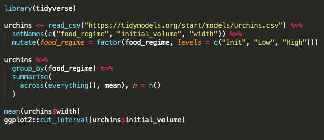
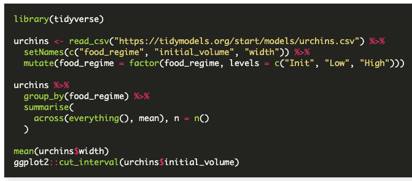
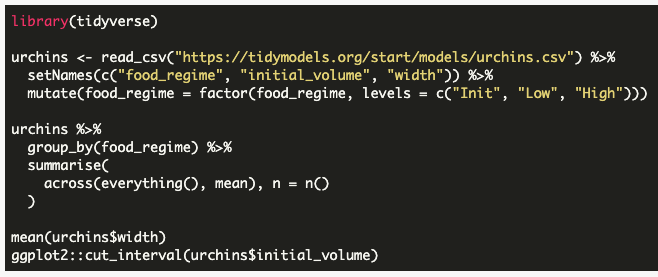
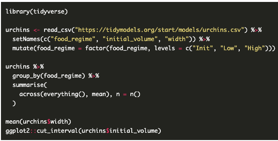

Hugo organization: https://gohugo.io/templates/lookup-order/
Kind 
* ex, home page
* single page `_default/single.html` (regular content page like blog post)
* list page `_default/list.html` (section listings, home page, lists, terms)

Lookup rules for layouts
* layouts/_default/...
* layouts/blog/... (for content in blog or any other *section*)


Content View Templates: https://gohugo.io/templates/views

Content Summaries: https://gohugo.io/content-management/summaries/
* useful for previews of projects?
* https://gohugo.io/templates/views#summaryhtml
  * entire page object is passed to `summary.html`
  * can add summaries to a list to make a standard blog type view. 
  * this could be an effective alternative to the current format of lists

* by default, takes the first 70 words as a preview to the content
  * can manually place summary marks in text, and will get full render
    of html content. 
  * Front matter summary: unique front matter to create as summary


Section: https://gohugo.io/templates/section-templates/
* these are folders under `content` like `/blog/index.html`. 
* sections can have templates


How can I have custom partials per section?


```{r setup, include=FALSE}
library(magrittr)
knitr::opts_chunk$set(echo = TRUE, warning=FALSE, message=FALSE, eval = FALSE,
                      results='show', cache=FALSE, autodep=FALSE, error = TRUE)

# knitr::knit_hooks$set(
#   source = highlight::hl_hook_source,
#   document = highlight::hl_hook_css
# )
```

+--------------+--------+---------------+
| highlighter  |  type  |     tokens    |
+==============+========+===============+
| highlight.js | client | strings,      |
|              |        | keywords      |
+--------------+--------+---------------+
| sublime      | n/a    | strings,      |
|              |        | keywords,     |
|              |        | arguments,    |
|              |        | functions,    |
|              |        | operators     |
|              |        |               |
+--------------+--------+---------------+
| Hugo         | server | strings,      |
|              |        | keywords,     |
|              |        | functions,    |
|              |        | operators     |
+--------------+--------+---------------+
| Github       | n/a    | strings,      |
|              |        | argumnets,    |
|              |        | some keywords |
+--------------+--------+---------------+
| RStudio      | n/a    | strings,      |
|              |        | keywords,     |
|              |        | operators,    |
|              |        | parentheses   |
+--------------+--------+---------------+

the declaration that appears last in your CSS file takes precedence.
So it might be possible to load multiple styles and active .js
to highlight source code in a gallery fashion. 

https://uxengineer.com/css-specificity-avoid-important-css/


Adding `css` to head based on specific events:
https://stackoverflow.com/questions/10665268/correct-way-to-include-css-after-head

highlighter demo: http://tutsplus.github.io/syntax-highlighter-demos/rainbow.html
  * this person has one page per demo. Is there a way I can put it all
    on one page?
    
    
Unloading style sheets:
https://stackoverflow.com/questions/5033650/how-to-dynamically-remove-a-stylesheet-from-the-current-page
  * this doesn't quite work. It removes the style sheet, so retroactively
    removes style from previous elements. 

Page of iframes:
  * build a page per like this: 
    http://tutsplus.github.io/syntax-highlighter-demos/rainbow.html
  
  * embed these pages as an iframe in a central gallery page
  * use a new `single.html` to modify content so title is stripped
    from resulting page. 
    
  * can I use page bundles to limit the css/js for highlighting to only those
    pages? Otherwise I have to include them for the entire website.
    https://gohugo.io/content-management/page-resources/
    
  * 


`class.source` to add `language-r` tags
  * can I improve this knitir hook to add this output based on the 
    knitr chunk type?

```js
var sheet = document.getElementById(styleSheetId);
sheet.disabled = true;
sheet.parentNode.removeChild(sheet);
```

Grouping by year
https://github.com/yihui/yihui.org/blob/703d24b0ce678150a67749ed417dcef532f1b304/layouts/_default/list.html#L4


## Monokai

Sublime



Hugo



highlight.js



rainbow.js



### Github

Actual Github


highlight.js

```{r eval=FALSE}
library(tidyverse)

urchins <- read_csv("https://tidymodels.org/start/models/urchins.csv") %>%
  setNames(c("food_regime", "initial_volume", "width")) %>%
  mutate(food_regime = factor(food_regime, levels = c("Init", "Low", "High")))

urchins %>%
  group_by(food_regime) %>%
  summarise(
    across(everything(), mean), n = n()
  )

mean(urchins$width)
ggplot2::cut_interval(urchins$initial_volume)
```

### RStudio


### Unique highlighting

There is also the highlight [R package](https://github.com/romainfrancois/highlight),
which does semantic highlighting, where words have
unique coloring depending on the context.

```{r echo=FALSE, results='asis'}
library(highlight)
highlight(code, detective = sherlock()) %>% cat()
```

pandoc themes. They are conclusively covered here,
so I won't provide a full array: https://www.garrickadenbuie.com/blog/pandoc-syntax-highlighting-examples/


https://github.com/rstudio/blogdown/issues/360

### Themes and Parsing

Client-side and server-side.

### Commonalities

Save for the unique semantic highlight, there we can find commonalities along
two dimensions: themes and syntax.

Themes are primarily designed around colors, but even then there isn't
a lot of consistency between implementations.

And then there are the parsing rules. These rules decide which tokens gets
highlighted.

The problem with highlight.js is that there aren't enough parsing rules:

```html
<pre class="r">
  <code class="hljs">
    <span class="hljs-keyword">library</span>(tidyverse)

    urchins &lt;- read_csv(<span class="hljs-string">"https://tidymodels.org/start/models/urchins.csv"</span>) %&gt;%
    setNames(c(<span class="hljs-string">"food_regime"</span>, <span class="hljs-string">"initial_volume"</span>, <span class="hljs-string">"width"</span>)) %&gt;%
    mutate(food_regime = factor(food_regime, levels = c(<span class="hljs-string">"Init"</span>, <span class="hljs-string">"Low"</span>, <span class="hljs-string">"High"</span>)))

    urchins %&gt;%
    group_by(food_regime) %&gt;%
    summarise(
      across(everything(), mean), n = n()
    )

    mean(urchins$width)
    ggplot2::cut_interval(urchins$initial_volume)
  </code>
</pre>
```

Only strings and the word `library` are being highlighted.

Ideas to improve highlight.js: https://stackoverflow.com/questions/51110878/how-to-highlight-all-r-function-names-with-highlight-js


Rainbow is interesting. In monokai, certain tokens are parsed, but not 
colored by the theme.
```html
<pre class="language-r rainbow-show" data-trimmed="true"><code class="rainbow rainbow-show"><span class="function call">library</span>(tidyverse)

urchins <span class="keyword operator">&lt;-</span> <span class="function call">read_csv</span>(<span class="string">"https://tidymodels.org/start/models/urchins.csv"</span>) %<span class="keyword operator">&gt;</span>%
  <span class="function call">setNames</span>(<span class="function call">c</span>(<span class="string">"food_regime"</span>, <span class="string">"initial_volume"</span>, <span class="string">"width"</span>)) %<span class="keyword operator">&gt;</span>%
  <span class="function call">mutate</span>(food_regime <span class="keyword operator">=</span> <span class="function call">factor</span>(food_regime, levels <span class="keyword operator">=</span> <span class="function call">c</span>(<span class="string">"Init"</span>, <span class="string">"Low"</span>, <span class="string">"High"</span>)))

urchins %<span class="keyword operator">&gt;</span>%
  <span class="function call">group_by</span>(food_regime) %<span class="keyword operator">&gt;</span>%
  <span class="function call">summarise</span>(
    <span class="function call">across</span>(<span class="function call">everything</span>(), mean), n <span class="keyword operator">=</span> <span class="function call">n</span>()
  )

<span class="function call">mean</span>(urchins<span class="keyword operator">$</span>width)
<span class="namespace">ggplot2</span><span class="keyword operator">::</span><span class="function call">cut_interval</span>(urchins<span class="keyword operator">$</span>initial_volume)</code><div class="preloader"><div></div><div></div><div></div><div></div><div></div><div></div><div></div></div><div class="preloader"><div></div><div></div><div></div><div></div><div></div><div></div><div></div></div></pre>
```


