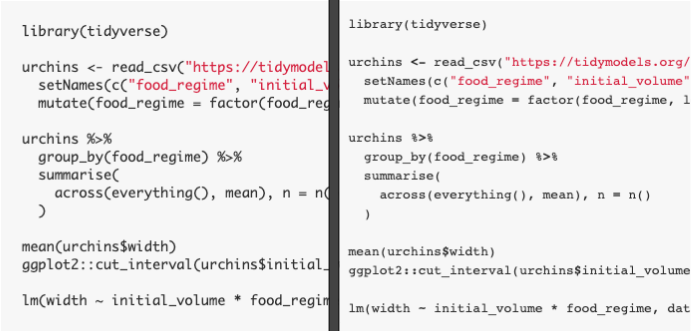

```{r setup, include=FALSE}
knitr::opts_chunk$set(echo = TRUE, warning=FALSE, message=FALSE, eval = FALSE,
                      results='show', cache=FALSE, autodep=FALSE, error = TRUE)
```

## Themes and Parsing

There are two dimensions to syntax highlighting: parsing and themes.

Parsing are the tokens identified by the highligher. The theme defines
how those individual tokens are styled.

### Parsing

Parsing is the foundation of syntax highlighting, because it defines the space
of possible highlighting.

For examples,
here are the tokens identified by some of the popular syntax highlighters:

+--------------+--------+----------------------------------------------------+
| highlighter  |  type  |                       tokens                       |
+==============+========+====================================================+
| highlight.js | client | string,                                            |
|              |        | keyword                                            |
+--------------+--------+----------------------------------------------------+
| rainbow.js   | client | function call, string, keyword operator, namespace |
+--------------+--------+----------------------------------------------------+
| prism.js     | client | operator, punctation, string                       |
+--------------+--------+----------------------------------------------------+
| Hugo         | server | strings,                                           |
|              |        | keywords,                                          |
|              |        | functions,                                         |
|              |        | operators                                          |
+--------------+--------+----------------------------------------------------+
| sublime      | n/a    | strings,                                           |
|              |        | keywords,                                          |
|              |        | arguments,                                         |
|              |        | functions,                                         |
|              |        | operators                                          |
|              |        |                                                    |
+--------------+--------+----------------------------------------------------+
| Github       | n/a    | strings,                                           |
|              |        | arguments,                                         |
|              |        | some keywords                                      |
+--------------+--------+----------------------------------------------------+
| RStudio      | n/a    | strings,                                           |
|              |        | keywords,                                          |
|              |        | operators,                                         |
|              |        | parentheses                                        |
+--------------+--------+----------------------------------------------------+

Parsing annotates tokens in the code with specific CSS classes. Below,
I'll show some examples from my [R Sytnax Highlighting Gallery](/projects/r-syntax-highlighting-gallery).

Here's how `highlight.js` parses the following:

```html
<pre class="r language-r"><code class="hljs"><span class="hljs-keyword">library</span>(tidyverse)

urchins &lt;- read_csv(<span class="hljs-string">"https://tidymodels.org/start/models/urchins.csv"</span>) %&gt;%
  setNames(c(<span class="hljs-string">"food_regime"</span>, <span class="hljs-string">"initial_volume"</span>, <span class="hljs-string">"width"</span>)) %&gt;%
  mutate(food_regime = factor(food_regime, levels = c(<span class="hljs-string">"Init"</span>, <span class="hljs-string">"Low"</span>, <span class="hljs-string">"High"</span>)))

urchins %&gt;%
  group_by(food_regime) %&gt;%
  summarise(
    across(everything(), mean), n = n()
  )

mean(urchins$width)
ggplot2::cut_interval(urchins$initial_volume)

lm(width ~ initial_volume * food_regime, data = urchins)</code></pre>
```

+--------------+---------+-----------------------+
| highlighter  |  tokens |        example        |
+==============+=========+=======================+
| highlight.js | keyword | library               |
+--------------+---------+-----------------------+
| highlight.js | string  | "Init", "food_regime" |
+--------------+---------+-----------------------+

There really aren't that many words that `highlight.js` is even able to
highlight. This drastically limits the potential for highlighting.


Rainbow.js parsing includes more tokens:
```html
<pre class="r language-r rainbow-show" data-trimmed="true"><code class="rainbow rainbow-show"><span class="function call">library</span>(tidyverse)

urchins <span class="keyword operator">&lt;-</span> <span class="function call">read_csv</span>(<span class="string">"https://tidymodels.org/start/models/urchins.csv"</span>) %<span class="keyword operator">&gt;</span>%
  <span class="function call">setNames</span>(<span class="function call">c</span>(<span class="string">"food_regime"</span>, <span class="string">"initial_volume"</span>, <span class="string">"width"</span>)) %<span class="keyword operator">&gt;</span>%
  <span class="function call">mutate</span>(food_regime <span class="keyword operator">=</span> <span class="function call">factor</span>(food_regime, levels <span class="keyword operator">=</span> <span class="function call">c</span>(<span class="string">"Init"</span>, <span class="string">"Low"</span>, <span class="string">"High"</span>)))

urchins %<span class="keyword operator">&gt;</span>%
  <span class="function call">group_by</span>(food_regime) %<span class="keyword operator">&gt;</span>%
  <span class="function call">summarise</span>(
    <span class="function call">across</span>(<span class="function call">everything</span>(), mean), n <span class="keyword operator">=</span> <span class="function call">n</span>()
  )

<span class="function call">mean</span>(urchins<span class="keyword operator">$</span>width)
<span class="namespace">ggplot2</span><span class="keyword operator">::</span><span class="function call">cut_interval</span>(urchins<span class="keyword operator">$</span>initial_volume)

<span class="function call">lm</span>(width <span class="keyword operator">~</span> initial_volume <span class="keyword operator">*</span> food_regime, data <span class="keyword operator">=</span> urchins)</code><div class="preloader"><div></div><div></div><div></div><div></div><div></div><div></div><div></div></div></pre>```
```

+-------------+------------------+-------------------------------+
| highlighter |      tokens      |            example            |
+=============+==================+===============================+
| Rainbow.js  | function call    | library, setNames, mutate     |
+-------------+------------------+-------------------------------+
| Rainbow.js  | string           | "Init", "food_regime"         |
+-------------+------------------+-------------------------------+
| Rainbow.js  | keyword operator | `<-`, `=`, `>`, `~`, `*`, `$` |
+-------------+------------------+-------------------------------+
| Rainbow.js  | namespace        | ggplot2                       |
+-------------+------------------+-------------------------------+

Prism.js takes a different approach:

```html
<pre class="r  language-r"><code class=" language-r">library<span class="token punctuation">(</span>tidyverse<span class="token punctuation">)</span>

urchins <span class="token operator">&lt;-</span> read_csv<span class="token punctuation">(</span><span class="token string">"https://tidymodels.org/start/models/urchins.csv"</span><span class="token punctuation">)</span> <span class="token percent-operator operator">%&gt;%</span>
  setNames<span class="token punctuation">(</span>c<span class="token punctuation">(</span><span class="token string">"food_regime"</span><span class="token punctuation">,</span> <span class="token string">"initial_volume"</span><span class="token punctuation">,</span> <span class="token string">"width"</span><span class="token punctuation">)</span><span class="token punctuation">)</span> <span class="token percent-operator operator">%&gt;%</span>
  mutate<span class="token punctuation">(</span>food_regime <span class="token operator">=</span> factor<span class="token punctuation">(</span>food_regime<span class="token punctuation">,</span> levels <span class="token operator">=</span> c<span class="token punctuation">(</span><span class="token string">"Init"</span><span class="token punctuation">,</span> <span class="token string">"Low"</span><span class="token punctuation">,</span> <span class="token string">"High"</span><span class="token punctuation">)</span><span class="token punctuation">)</span><span class="token punctuation">)</span>

urchins <span class="token percent-operator operator">%&gt;%</span>
  group_by<span class="token punctuation">(</span>food_regime<span class="token punctuation">)</span> <span class="token percent-operator operator">%&gt;%</span>
  summarise<span class="token punctuation">(</span>
    across<span class="token punctuation">(</span>everything<span class="token punctuation">(</span><span class="token punctuation">)</span><span class="token punctuation">,</span> mean<span class="token punctuation">)</span><span class="token punctuation">,</span> n <span class="token operator">=</span> n<span class="token punctuation">(</span><span class="token punctuation">)</span>
  <span class="token punctuation">)</span>

mean<span class="token punctuation">(</span>urchins<span class="token operator">$</span>width<span class="token punctuation">)</span>
ggplot2<span class="token operator">::</span>cut_interval<span class="token punctuation">(</span>urchins<span class="token operator">$</span>initial_volume<span class="token punctuation">)</span>

lm<span class="token punctuation">(</span>width <span class="token operator">~</span> initial_volume <span class="token operator">*</span> food_regime<span class="token punctuation">,</span> data <span class="token operator">=</span> urchins<span class="token punctuation">)</span></code></pre>
```

+-------------+-------------+---------------------------------+
| highlighter |    tokens   |             example             |
+=============+=============+=================================+
| Prism.js    | operator    | `<-`, `=`, `%>%`, `~`, `*`, `$` |
+-------------+-------------+---------------------------------+
| Prism.js    | punctuation | `(`, `)`, `,`,                  |
+-------------+-------------+---------------------------------+
| Prism.js    | string      | "Init", "food_regime"           |
+-------------+-------------+---------------------------------+

### Themes

Themes determine the final appearance of the code. While parsing defines
the space of possibilities, the theme may not live up to it.

In the last section, we showed that the Rainbow.js parse is more complete
than highlight.js, since it labels more tokens. The parsing, however,
only defines the space of possibilities. It's the theme that's responsible
for the final appearance.

For the Github theme they look almost identical, although neither look anything
like the actual Github syntax highlighting for R.



On the left, we have [Highlight.js Github](/projects/r-syntax-highlighting-gallery/highlight.js-github/)
and on the right [Rainbow.js Github](/projects/r-syntax-highlighting-gallery/rainbow-github/).
If you look really closely (or follow the links to high-quality Gallery renders)
you'll see that Rainbow.js operators are _slightly_ darker than the ones in
Highlight.js.

Even if a parser identifies the token, it's the theme's choice whether to
emphasize certain tokens.
