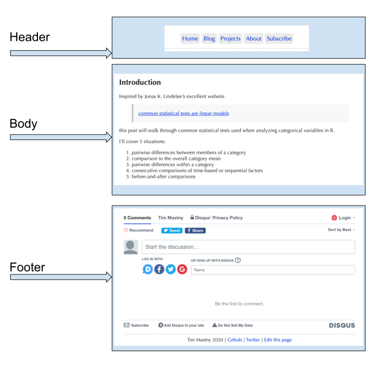
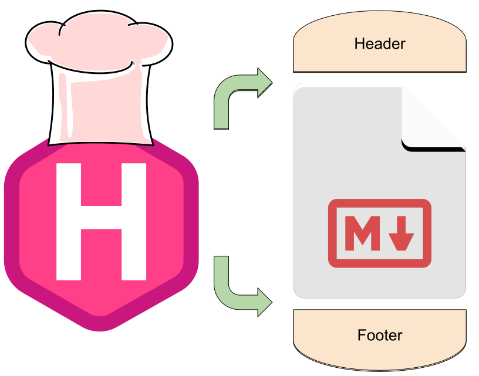
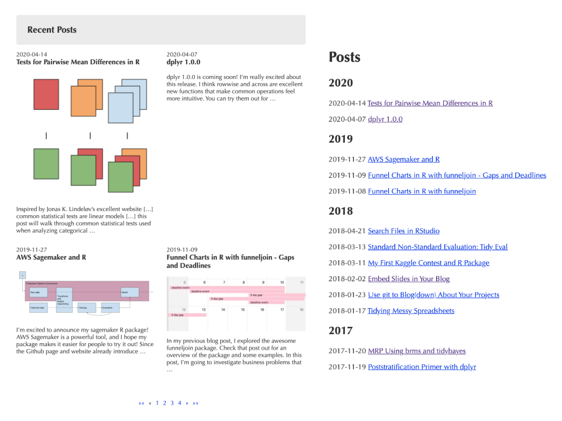
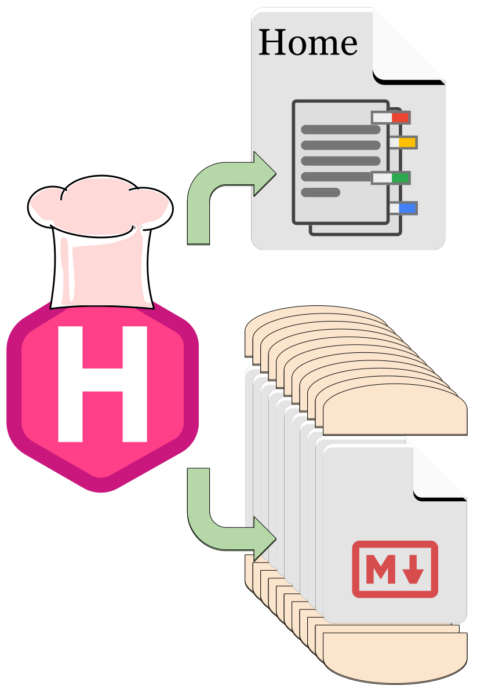

[Hugo](https://gohugo.io/) is the website development frame behind 
[blogdown](https://bookdown.org/yihui/blogdown/) and powers many 
websites like [tidyverse.org](https://github.com/tidyverse/tidyverse.org). 

Hugo is great, because it's so easy to get started. All of your content
can be basic [markdown](https://gohugo.io/content-management/formats/#learn-markdown)
or you can use blogdown or [hugodown](https://github.com/r-lib/hugodown)
to compile RMarkdown right into a blog post.
This magic lets writers, programmers, and data scientists focus on the
content without being overwhelmed with web-design and front-end development.

The saying goes, you don't want to learn how to sausage is made, but this time
is an exception: Hugo is a _Master Chef_ who would love to invite you into the
kitchen. 
The utensils are clean and [well-documented](https://gohugo.io/documentation/),
and the recipes are fun to follow. We'll go over the recipes Hugo uses to build
a webpage, and how Hugo maintains a menu of the latest blog posts. 

## Pages (and sandwiches)

A restaurant needs food and websites need content. With Hugo and 
[Hugo Themes](https://themes.gohugo.io/), you can focus on writing the content,
while Chef Hugo makes the rest of the dish. 

While the content is the most important part of the page, there are other
pieces of information and iconography on a website. In general, there are
3 sections to a webpage. I've used an example from my own website below:



The body contains the content you produce, 
in `*.md`, `*.Rmd` or even `*.html` formats.

The header and footer _sandwich_ the body with other relevant information. 
In my case, the header is the connection to the rest of my website, with
links to my home, blog, and projects.
The footer contains things that go at the end, like comments and additional
links off-site. 

Headers and footers also serve a purpose in web-development. 
Yihui Xie has an [instructional PR](https://github.com/yihui/hugo-xmin/pull/5)
on syntax highlighting showing that styling (CSS) goes in the header, 
and JavaScript goes in the footer.

Chef Hugo is responsible for combining these ingredients into an actual webpage: 


The recipe Chef follows is found in the theme, 
and is constructed with [Hugo Templates](https://gohugo.io/templates/introduction/).
Once again, Yihui Xie has another good example in this 
[snippet of code](https://github.com/yihui/hugo-xmin/blob/982dfb320e8ac58a78203be76c5b06beae25d4f9/layouts/_default/single.html#L1-L12)


```{r echo=FALSE}
html <- '{{ partial "header.html" . }}
<div class="article-meta">
<h1><span class="title">{{ .Title | markdownify }}</span></h1>
{{ with .Params.author }}<h2 class="author">{{ . }}</h2>{{ end }}
{{ if (gt .Params.date 0) }}<h2 class="date">{{ .Date.Format "2006/01/02" }}</h2>{{ end }}
</div>


<main>
{{ .Content }}
</main>


{{ partial "footer.html" . }}'

blogdown::shortcode_html(
  "highlight", "html", "style=pastie,hl_lines=1 10 14,linenos=true", .content = html
)
```

These 14 lines of code is the hugo template the [hugo-xmin](https://github.com/yihui/hugo-xmin)
uses to create a webpage. Lines 1, 10, and 14 are where the real action happens.
These lines tell Hugo to insert the body between header and footer to complete
the sandwich. 

The cool part is Hugo doesn't tell you how to make your website. 
Starting with a template like this, you can modify it any way you'd like!
And it's really fun with `blogdown::serve_site`: you can see your changes
happen almost in real-time.
Modifying your existing theme is a great way to learn about Hugo and web-design.
My own website [theme](https://github.com/tmastny/hugo-xmin)
evolved from Yihui's instructional theme.

## Lists (and menus)

As a Master Chef, Hugo knows some people want to make more than one sandwich; 
they want a whole _menu_ to build a restaurant. 

The same is true for a blog: you'll need a menu show-casing all your posts
so people can find and read them. I have two "menus" on my websites. 



Menus, posts, pages: at the end of the day they are all _lists_. 
Hugo knows you need it, so they built 
[list templates](https://gohugo.io/templates/lists/).
These are the instructions to find all your posts (sandwiches) and
list them all in one place (a menu).




Hugo is the master chef, putting buns on the protein and cheese we made.
But let’s refer back to our model of websites.
Posts (and projects) are only one type of web page.
We also have Home pages, project pages,
and places to scroll through our blog posts.
Conceptually, these pages are all **lists** of content below them.

A good Home Page will link to your blog and projects pages.
And your blog page will need to list all your articles so readers can scroll
through them to read and discover. Fundamentally, they are all lists.

Lucky for us, Hugo is a master chef.
Not only can they put buns on our burger, but they can also add the cheese.
So when necessary, Hugo glues on the header and footer,
and adds lists describing content below the tree.


## other


The goal isn’t to talk about the details of Hugo.
Both [Hugo](https://gohugo.io/documentation/) and
[blogdown](https://bookdown.org/yihui/blogdown/) have excellent
documentation on that front.
In this article, I’ll conceptually example hugo with diagrams.

Hugo makes it so you can focus on content.
We just need to fill in the “leaves” at the bottom of the tree:
the posts and projects.


One we do that, Hugo (and the Hugo theme) do all the work of making the website.

This post will explain what that work actually is.
We’ll attempt to explain the Hugo magic that powers blogdown and other websites
that make it easy to create websites, without knowing web development.

Why learn about Hugo? If you’ve ever wanted to customize your website,
it will help to understand what Hugo does and how it can help you.
Ideally, you’ll feel more confident making changes,
and maybe take a stab at customizing your theme.

To begin, we need to understand what a website is.
These days, websites can be incredibly complicated,
so let’s look at a model of a website you might use for a blog:
