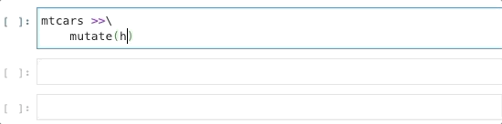

```{r setup, include=FALSE}
knitr::opts_chunk$set(
  echo = TRUE, warning=FALSE, message=FALSE,
  results='show', cache=FALSE, autodep=FALSE, error = TRUE
)
```

# Introduction

[Siuba](https://github.com/machow/siuba)
is an amazing port of [dplyr](https://dplyr.tidyverse.org/) to the python ecosystem. 
Like dplyr, siuba defines an domain specific querying language: 
you can use it query [pandas](https://pandas.pydata.org/pandas-docs/stable/index.html)
data frames, as well as SQL and Spark 
[data sources](https://github.com/machow/siuba#using-with-a-sql-database).

One killer feature of dplyr is the tab-completion of columns provided in RStudio.


It would be really cool if this worked in siuba, and now it does!



Simply import the following in a Jupyter Notebook to get started.

```{python, eval=FALSE}
import siuba.experimental.completer
```


I worked on a small PR with Michael Chow 
([Github](https://github.com/machow), [Twitter](https://twitter.com/chowthedog)),
the creator of Siuba to make this a reality!

I'm excited to share what I learned about IPython and Siuba in the progress.

# Completion

How does RStudio tab-complete work?

The RStudio tab-completer is context aware: 
it knows that the cursor is in a `%>%` pipe chain, and that the `mtcars`
data frame is the input. 

It then inspects the `mtcars` data frame for column names
and suggests them during tab-completion.

We took a similar approach with Siuba.

## IPython and Completions

We need a way to inspect Python objects and find relevant context.

The secret ingredient here is IPython: 
not only does IPython power (python) Jupyter notebooks,
but everything in IPython _**is also a Python object**_.

This means we can search, inspect, find, and modify everything in the
notebook programmatically!


### Environment

First, we want find all data frames defined in the environment.

There a couple different ways to do this, but IPython has a built-in
shortcut using 
[magics](https://ipython.readthedocs.io/en/stable/interactive/magics.html#magic-who_ls).

```{python, eval=FALSE}
IPython.get_ipython().run_line_magic("who_ls", "DataFrame")
```


## Commands

After finding candidate data frames, we want find the data frame
in the most relevant context. 
At the moment, that's defined to be the data frame
referenced in the most recent input. IPython [keeps a log](https://ipython.readthedocs.io/en/stable/api/generated/IPython.core.history.html#IPython.core.history.HistoryAccessor.get_tail)
of all inputs and outputs to search through.


I think there's a lot of room for improvement. RStudio definitely
has a more sophisticated method, because it doesn't rely on previously 
executed code. 

But it works surprisingly well,
and once you know the quirk you can easily fire off a new input with the
data frame you want to complete to get it working again.


## Completion

This is my favorite part. Know that you can think of `_` as a placeholder
for the actual data frame (see [Appendix Siuba](#siuba) for more details).

Well, we literally put the data frame object into the placeholder. 
Effectively, IPython runs tab-completion on `df.<TAB>`! 
The trick is four lines of code [inserted](https://github.com/tmastny/siuba/blob/7a234bc6d03b7ad3ba6054c8899fd27ccb7f05aa/siuba/experimental/completer.py#L32-L36)
into the [Jedi](https://jedi.readthedocs.io/en/latest/index.html)
completer method IPython uses. IPython *kinda* encourages this behavior
with [hooks](https://ipython.readthedocs.io/en/stable/api/generated/IPython.core.hooks.html?highlight=hooks),
[extensions](https://ipython.readthedocs.io/en/stable/config/extensions/index.html),
and [start-up scripts](https://ipython.readthedocs.io/en/stable/interactive/tutorial.html#startup-files)
but in this case we had to be a little more invasive. 


This method also has a side benefit of working really well with pandas Series methods,
so completions like `_.hp.<TAB>` also provide suggestions.

# Appendix

## Siuba

One major syntactical difference between Siuba and dplyr is how
columns are referenced.

In dplyr, we just write the name of the column:
```
hp
```
dplyr calls this a [data-variable](https://dplyr.tidyverse.org/articles/programming.html#data--and-env-variables),
but it might also be referred to as
the _bare name_ or the _unquoted name_.

With Siuba we need to use `_.` as a prefix to the column name.
```
_.hp
```

`_` can be thought of as the [`.data` pronoun](https://dplyr.tidyverse.org/articles/programming.html#indirection)
from dplyr. For example, you can also write the dplyr expression like this:

```{r, eval=FALSE}
mtcars %>%
  mutate(hp = .data$hp -  mean(.data$hp))
```

which is very similar to how I wrote the expression in Siuba: 
`_` stands in for the actual name of the data frame, 
and `.` is used for column names and attributes.

### Why not `hp`?

Why can't we just use `hp` like in R? There's a couple reasons.

Python doesn't have the tools built-in to make this easy. 
By default, Python would try to search for the value of `hp` in the environment,
rather than the data. And once it couldn't find it, it would throw an
error.

It also goes against Python convention and intuition. 
When working with languages, you have expectations for how things should work,
and communication is easier if you follow those expectations.
In R this kind of stuff is normal, but in Python it would be quite surprising. 

In fact, if you really want to, you can almost make this work: 
[Wes McKinney](https://wesmckinney.com/blog/python-r-and-the-allure-of-magic/), 
the creator pandas, did an experiment in 2011 showing how something like this 
could be possible in Python. But he also concluded that this didn't really
fit into the Python philosophy.


## Basic Python Completion

Normal tab-completion in Python isn't very magical. 
All attributes and methods that don't start with an underscore are
suggested. The names of these attributes and methods are easily found
with the built-in function [`dir`](https://docs.python.org/3/library/functions.html#dir).

Customization can be added by defining a method named
[`__dir__`](https://docs.python.org/3/reference/datamodel.html#object.__dir__)
in the object. 

This is the simplest way [IPython](https://ipython.readthedocs.io/en/stable/config/integrating.html)
and finds completion suggestions. 
For example, pandas provides [tab-completion](https://github.com/pandas-dev/pandas/pull/5050/files#diff-9c718a39eb63c1bfac4fbeacf2906ffdR56-R60)
for data frame columns by defining the the custom `__dir__` method

siuba's needs are more complicated. There's no data frame information stored
within the data pronoun `_`. We need to search the surrounding context
for a suitable data frame and that requires IPython.


