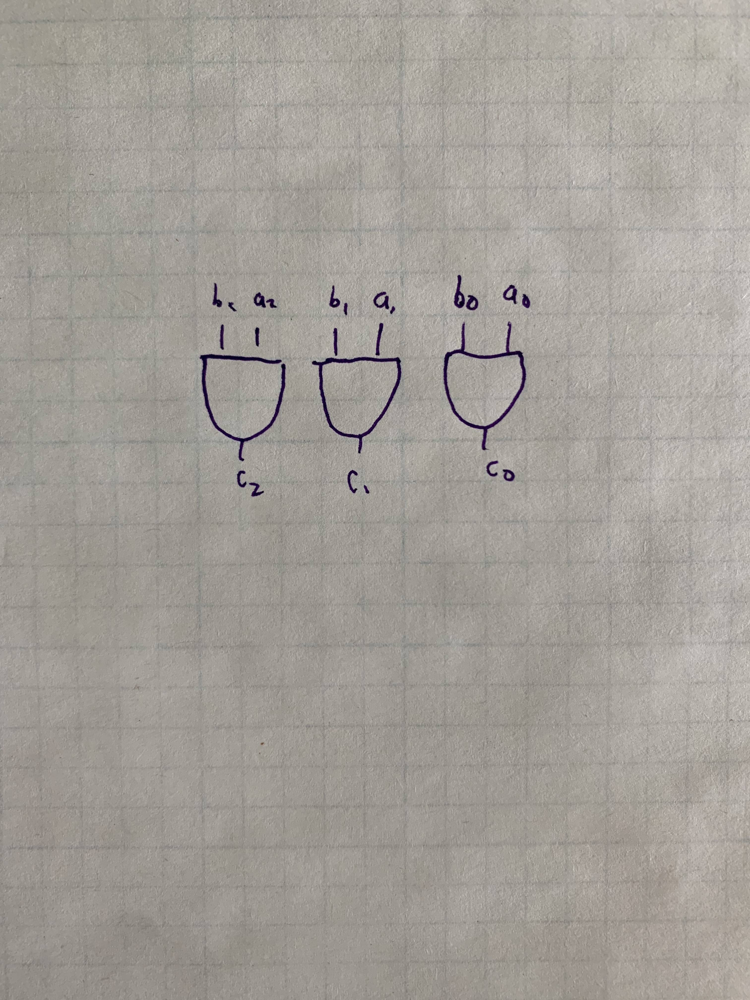
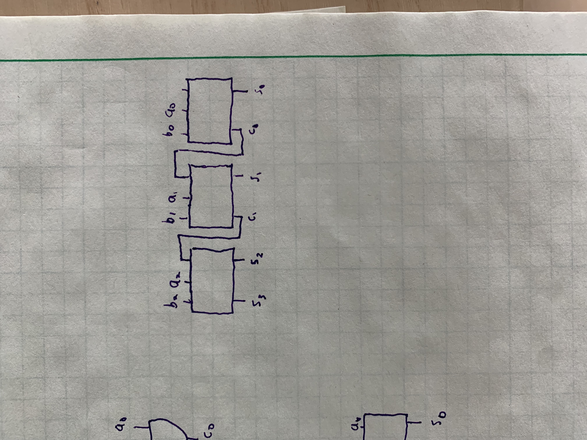

```{r setup, include=FALSE}
knitr::opts_chunk$set(
  echo = FALSE, warning = FALSE, message = FALSE,
  results = "show", cache = FALSE, autodep = FALSE, error = TRUE
)
```

## Introduction

It surprised me to discover that the time complexity to add
two `n`-bit numbers is `O(log n)`.

That lead me to study hardware vs. software complexity
analysis.


## Elementary School Adding Algorithm

The addition algorithm for binary numbers is the same as the
one learned in elementary school^[Example: https://en.wikipedia.org/wiki/Binary_number#Addition]:

```
  1 1 1 1 1    (carried digits)
    0 1 1 0 1
+   1 0 1 1 1
-------------
= 1 0 0 1 0 0 = 36
```

The proof of this algorithm relies on the fact that the sum of any
3 single-digit numbers is at most two digits.

This algorithm is sequential: we need to result of the previous
iteration before we can correctly compute the
sum of the current iteration.

This seems like `O(n)` must be the faster possible time complexity
for adding two numbers.

When implemented in a circuit, this is called the ripple carry adder.

## Hardware Parallelism

Each bit of an `n`-bit number is stored on a lead. A lead is a wire
that can connect to another circuit. A lead can be in two states, `0`
or `1`.

We could take the bitwise `AND` of two `n`-bit numbers `a` and `b`
by each of their leads to an `AND` gate:



This offers a different model of computational complexity: bitwise
`AND` can be done in `O(1)` constant time, but requires `O(n)` space.

In circuits, space analogous to memory complexity, but can also
be thought of as the number of gates, cost, or physical space required
on a circuit board.

### Hardware Adder

If we implement the elementary school adder in hardware,
the time complexity is still `O(n)`. The parallelism doesn't
help, because each circuit has to the wait for the previous
carry digit:




https://www.ece.uvic.ca/~fayez/courses/ceng465/lab_465/project1/adders.pdf


## Carry-lookahead

We can improve this algorithm by investigating when the circuit produces a carry.
If `a AND b`, then there will be a carry. If `a OR b` and there is a carry from
the last iteration, then there will be a new carry. These are called
generating and propagating carries, respectively. We can summarize this
with symbols as follows:

$$
\begin{align*}
c_{i + 1} &= a_i b_i + (a_i + b_i) c_i \\
c_{i + 1} &= g_i + p_i c_i
\end{align*}
$$

Let's work out the 4-bit carries:

$$
\begin{align*}
c_{1} &= g_0 + p_0 c_0 \\
c_{2} &= g_1 + p_1 c_1 \\ 
c_{3} &= g_2 + p_2 c_2 \\
c_{4} &= g_3 + p_3 c_3 \\
\end{align*}
$$

At first, this doesn't seem like an improvement, because each
carry depends on the previous carry. But let's substitute
carries into $c_4$:

$$
\begin{align*}
c_{4} &= g_3 + p_3(g_2 + p_2 (g_1 + p_1 (g_0 + p_0 c_0))) \\
c_{4} &= g_3 + p_3g_2 + p_3 p_2 g_1 + p_3 p_2 p_1 g_0 + p_3 p_2 p_1 p_0 c_0
\end{align*}
$$


The dominating term is $p_3 p_2 p_1 p_0 c_0$,
with length proportional to `n`. Calculating this with
successive `AND` operations is still `O(n)`. But we can
divide-and-conquer to calculate this in `O(log n)`:


The time from the input to the output is the height of the tree.
Since this is a binary tree, that gives `O(log n)` time complexity.

Since $p_3 p_2 p_1 p_0 c_0$ is the dominating, the time complexity
of that operation is the time complexity of adding all the bits. 
So the time complexity of adding two numbers is `O(log n)`!

## Space Complexity

The problem is the space complexity. This algorithm relied
on creating a binary tree for each of it's inputs. While
the height of that tree is `O(log n)`, the number of nodes of the tree
(or the number of `AND` gates) is `O(2^n)`.

This is very expensive in terms of hardware. Each `AND` gate costs 
money, and the each gate takes up physical space on a circuit board.
This algorithm is not feasible for even relatively small `n`.

## Real-world Implementation

Because of the cost and physical space, carry-lookahead adders
are not implemented for standard `2^32` bit integers. 

The standard algorithm would require gates proportion to 32, while
carry-lookahead would require 2^32 = 4,294,967,296.

Instead, carry-lookahead adders are implemented using 4-bit sections
and chained together that time complexity is still O(n),
but with a constant factor speedup.
