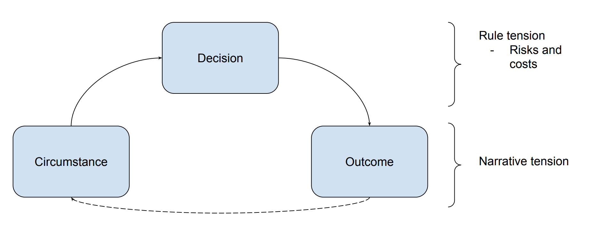

```{r setup, include=FALSE}
knitr::opts_chunk$set(
  echo = FALSE, warning = FALSE, message = FALSE,
  results = "show", cache = FALSE, autodep = FALSE, error = TRUE
)
```

## Introduction

When I design campaigns and run encounters, I want to create longlasting memories
for my friends and I to share.
One kind of moment enshired to tabletop legend is when a player
succeeds when the stakes are high.
To this day my party talks about 3 back-to-back criticals on the big bad right when the party was about the perish.
Or when the wizard wove a wall of stone through the battlefield, turning the tide of war.
These situations often happen when the narrative is tense. Game mechanics
and rules magnify that tension, whether by dice rolls or exceptional tactics.

In this post, I propose an encounter model to show how the rules and mechanics
of a game can influence the tension a player feels when they make a decision.
Dungeon Masters can use this model to choose role-playing systems suitable for the party and campaign.
They can also use it to create new systems or modify existing ones.

My goal is to provide a tool Dungeon Masters can use to make better
campaigns and encounters, like Justin Alexander's [Node-Based Scenario Design](https://thealexandrian.net/wordpress/7949/roleplaying-games/node-based-scenario-design-part-1-the-plotted-approach)
for investigative role-playing games.

## Encounter Model



*Circumstance, Decision, Outcome* is a three-stage encounter model.
As you will see below, the model applies to micro and macro encounters.
It's relevant when a player decides to cast fireball in a round of combat and
when the party decides to storm a lair.


> *Circumstance:* The guard walks into the shop and sees you with the jewels.

The circumstance is the situation described to the player.
It controls the degree of tension:
confronting the villian to save the world is more tense
than sneaking past a guard to steal gold.


> *Decision:* I attempt to jump through the window and flee.

The decision is the choice the player makes in that moment.
The responsibility to make a good choice adds to the tension
set in the circumstance. I cover this in detail in the next section.


> *Outcome:* You jump through the open window and land gracefully in front of a squard of guards.

The outcome is what happens after the decision.
If the outcome is good and the tension was high, players feel victorious.
If the outcome is bad, players feel defeated.
Most Dungeon Masters avoid [defeating the players](https://theangrygm.com/death-sucks/).
You want them to feel as if they could lose, but you don't want them to actually lose.

So instead of resolving the tension with overt failure, the tension is *delayed* or increased.
And the outcome becomes the new circumstance. For example, the players
stormed the villian's lair and were defeated. The outcome is that the villian summoned the demon
and locked the party in the dungeon.
The new circumstance is that they must escape the dungeon and defeat both the villian and the demon.


## Decision Tension

If the narrative sets the tension in the circumstance, then player choice
amplifies tension in the decision. The rules govern what choices a player may make.
Each choice comes with risks and costs that create tension.

### Risk

Risk is inherent to decision making, but there are two ways
rules influence risk: by adding a random chance for failure
and by increasing the likelihood of mistakes via game complexity.

A pure random chance of failure is tense--think Russian roulette.
This kind of tension happens when players have no control and wish they did.
This, however, is tension of *circumstance* not decision.
Tension is decision tension only when the player willingly chooses the risky option.

The fear of making mistakes also increases tension. Mistakes occur
when the situation is complex and the wrong decision could lead to failure.
When players opt for a complicated tactic or have to choose the right
spell out of dozens there is a risk they made a mistake.
The tension here can also manifest outside the narrative: the fear of looking stupid or
the opportunity to look smart.

Most role-playing systems combine
randomness and complexity to heighten the tension, and these are
the ones I like. I want my players to think "I hope this works!"

### Costs

A decision has a cost if it depletes a resource managed by the game rules.
Players may fear that spending this resource was a mistake, increasing the tension
as I described above.
The difference is that rules prevent the same decision from being made in the future.
Whereas if the decision didn't have a cost,
the choice can be made again if the circumstance allows.^[Another way to think about it: mistakes without mechanical costs are only [opportunity costs](https://en.wikipedia.org/wiki/Opportunity_cost).]

Costs increase tension now and in the future.
For example, if a player spends a 9th level spell slot they pray for a good outcome, because they
won't get the chance again. Likewise, the loss raises tension in future encounters,
because they may wish they had that resource--tension from regret.

## Conclusion

By identifying the rules that increase tension,
I can more easily chose and describe systems that are a good fit for my party and campagin.
The next post in this series will use the encounter model to show why
Gumshoe is a great system for investigative role-playing games.
