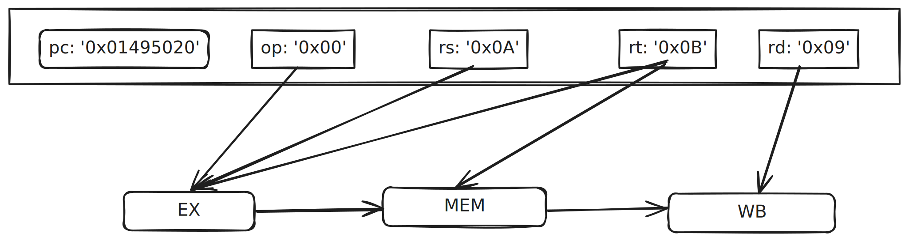
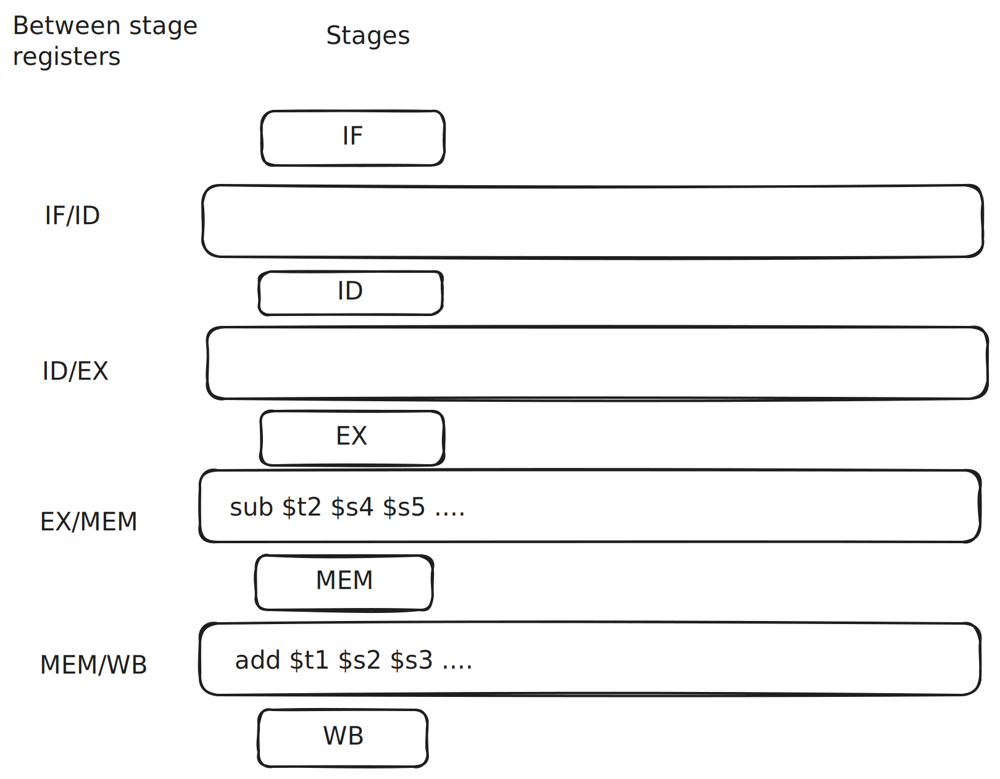
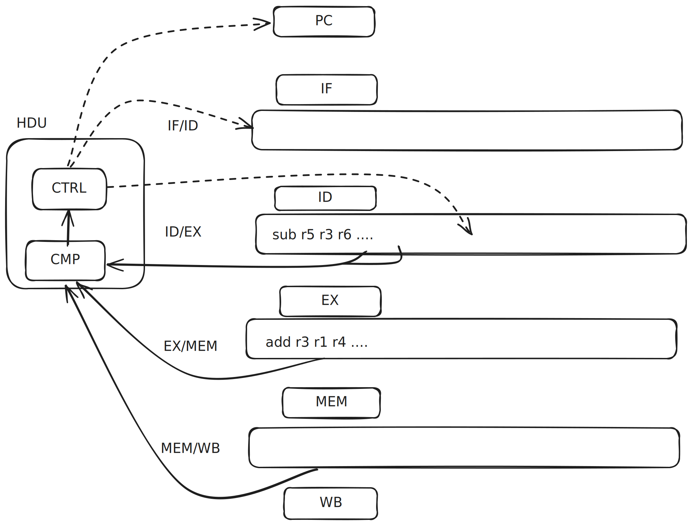
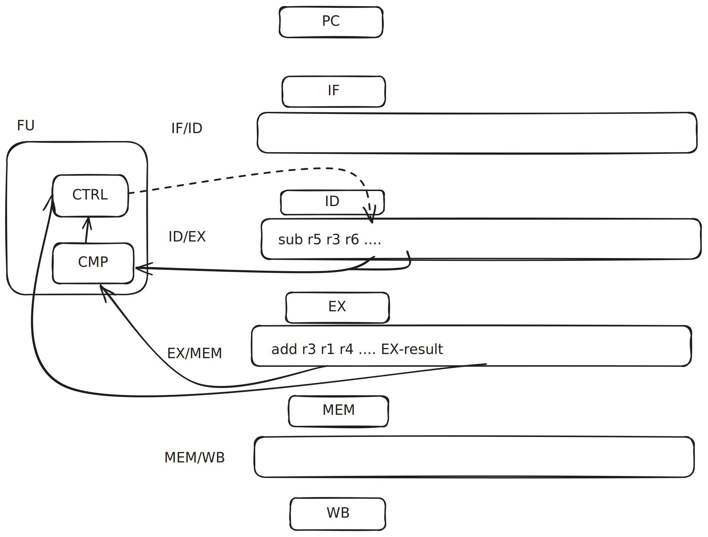

```{r setup, include=FALSE}
knitr::opts_chunk$set(
  warning = FALSE, message = FALSE,
  results = "show", cache = FALSE, autodep = FALSE, error = TRUE
)
```

I want to share what I've learned about CPU pipelining. 
Thanks to Dan Luu's branch [prediction write-up](https://danluu.com/branch-prediction/)
I was vaguely aware how this worked conceptually, 
but I was motivated to divide into the details after reading
Rodrigo Copetti's [Playstation MIPS write-up](https://www.copetti.org/writings/consoles/playstation/#bibref:9)
where he talked the need for
branch delay slots and how later CPUs used this to as an advantage
with branch *prediction*. I quickly found many subtle and
fasincating details on CPU pipelining that I had to share. 
For more details, I recommend 
chapter 4 of Computer Organization and Design.

This post will assume you are familiar with the [laundry](https://www.cybercomputing.co.uk/Languages/Hardware/laundryAnalogy.html)
or "assembly-line" model of CPU pipelining, but are hazy on some of the
lower-level details. It will also help to have a vague idea of 
the 5-stage MIPS pipeline ([this](https://courses.cs.washington.edu/courses/cse410/05sp/lectures/cse410-10-pipelining-a.pdf)
is a nice, brief high-level summary).

## CPU Visualizations

Let's start by visualizing a basic CPU model that does not have pipelining 
(aka a single-cycle CPU design):

```{=html}
<div id="nonpipeline-container"></div>

<script>
document.addEventListener('DOMContentLoaded', function() {
  const container = document.getElementById('nonpipeline-container');
  container.innerHTML = createPipelineHTML('nonpipelineViz');
  
  window.nonpipelineViz = new PipelineVisualization(
    document.getElementById('nonpipelineViz'),
    {
      instructions: [
        "add $t1",
        "sub $t2",
      ],
      sequence: [
        { pc: 0 },
        { pc: 1, if: "add $t1" },
        { pc: 1, id: "add $t1" },
        { pc: 1, ex: "add $t1" },
        { pc: 1, mem: "add $t1" },
        { pc: 1, wb: "add $t1" },
        { pc: 2, if: "sub $t2" },
        { pc: 2, id: "sub $t2" },
        { pc: 2, ex: "sub $t2" },
        { pc: 2, mem: "sub $t2" },
        { pc: 2, wb: "sub $t2" },
        { pc: null }
      ]
    }
  );
});
</script>
```

One bottleneck is that only one component of the CPU is
active at a time: all others are inactive.

Pipelined CPUs fill in these vacancies by running instructions
through the stages one after the other, rather than waiting
for a single instruction to completely finish.

```{r, echo=FALSE}
htmltools::includeHTML("pipeline.html")
```

 
```{=html}
<div id="pipeline1-container"></div>

<script>
document.addEventListener('DOMContentLoaded', function() {
  const container = document.getElementById('pipeline1-container');
  container.innerHTML = createPipelineHTML('pipelineViz1');
  
  window.pipelineViz1 = new PipelineVisualization(
    document.getElementById('pipelineViz1'),
    {
      instructions: [
        "add $t1",
        "sub $t2",
        "lw $t3",
        "add $t5",
        "and $t4"
      ],
      sequence: [
        { pc: 0 },
        { pc: 1, if: "add $t1" },
        { pc: 2, if: "sub $t2", id: "add $t1" },
        { pc: 3, if: "lw $t3", id: "sub $t2", ex: "add $t1" },
        { pc: 4, if: "add $t5", id: "lw $t3", ex: "sub $t2", mem: "add $t1" },
        { pc: null, if: "and $t4", id: "add $t5", ex: "lw $t3", mem: "sub $t2", wb: "add $t1" },
        { pc: null, id: "and $t4", ex: "add $t5", mem: "lw $t3", wb: "sub $t2" },
        { pc: null, ex: "and $t4", mem: "add $t5", wb: "lw $t3" },
        { pc: null, mem: "and $t4", wb: "add $t5" },
        { pc: null, wb: "and $t4" },
        { pc: null }
      ]
    }
  );
});
</script>
```

This seems pretty natural: it's like an multiple person assembly line.
But there are some subtle implementation details 
that help solve more complicated problems. 

## Instruction Decoding

Instruction decoding orchestrates the entire pipeline
by providing fields used by the other stages.

Let's work through an simplified example. 
Say the instruction is
```
add $t1, $s2, $s3
```
The IF stage fetches the instruction and puts it into 
the ID stage register. Now the ID register contains
fields that will be used by all the remaining stages.
```
pc: 0x014b4820
-> 
Field   op      rs      rt      rd      shamt   funct
Binary  000000  01010   01011   01001   00000   100000
#       add     $s2     $s3     $t1
```

* EX will use `op`, `rs`, and `rt` for the ALU
  operation and inputs
* MEM (for `lw` and `sw`) uses `rt` 
* WB will write to register `rd`

```{r, echo=FALSE}

```

With pipelining, we have a problem. 
For example, in cycle 3 in the previous visualization, 
`add` moves into EX and `sub` moves into ID.
But WB needs to know the `rd` of the `add` instruction! 
That field used to be safely stored in the ID register, 
but `sub` overwrote it. 

The solution is to have registers between each pipeline stage
that carry fields from the ID stage (as well as other stages).

```{r, echo=FALSE}

```

Now when `add` reaches WB, it has the `rd` field so it
can write to the correct register. The actual value
from EX or MEM is also stored in the MEM/WB register as well. 

## Hazard detection 

The field metadata from ID needs to be available at each stage
to enable basic operations like writing back to the registers, 
but the fields also turn out to be crucial to solve data hazards. 

To start, let's look at this example:
```{=html}
<div id="pipelineblocked-container"></div>

<script>
document.addEventListener('DOMContentLoaded', function() {
  const container = document.getElementById('pipelineblocked-container');
  container.innerHTML = createPipelineHTML('pipelineblocked');
  
  window.pipelineblocked = new PipelineVisualization(
    document.getElementById('pipelineblocked'),
    {
      instructions: [
        "add r3, r1, r4",
        "sub r5, r3, r6"
      ],
      sequence: [
        { pc: 0 },
        { pc: 1, if: "add r3, r1, r4" },
        { pc: 2, if: "sub r5, r3, r6", id: "add r3, r1, r4" },
        { pc: null, id: "sub r5, r3, r6", ex: "add r3, r1, r4" },
      ]
    }
  );
});
</script>
```

`sub` has a dependency on the output of `add`: this is called a 
data hazard. Structurally, the CPU could proceed but the result 
would be incorrect. We need a way to check if any of the inputs
of the instruction in ID matches the output register for any 
downstream instructions. 

Since the field metadata is propogated to each stage register,
we have all the data we need! What's missing is a unit to calculate
this:
```
ID/EXE.rs == EX/MEM.rd || ID/EXE.rt == EX/MEM.rd ||
ID/MEM.rs == MEM/WB.rd || ID/MEM.rt == MEM/WB.rd
```

That's the *Hazard Detection Unit* (HDU). This unit will attach to
the ID stage and will both detect a hazard
and prevent progress until the hazard is resolved.

> This hazard detection logic works for "R-type" instructions
that write to registers (like `add` and `and`), but not every
instructions write to registers (like `sw`). We'd technically
need to check a few other conditions for a complete implementation,
especially around data hazards involving `lw` and `sw`. 

```{r, echo=FALSE}

```

The solid lines show the inputs to the HDU, detecting the hazard.
The dotted lines are the control signals, stopping the PC and IF
and writing a `nop` instruction to the ID/EXE register.

The `nop` will proceed through each stage, eventually causing the
hazard comparison logic to be false. This will lift the stall
on the PC and IF stages, and remove the `nop` signal from the 
ID/EXE register, allowing the `sub` instruction to continue. 

```{=html}
<div id="pipeline2-container"></div>

<script>
document.addEventListener('DOMContentLoaded', function() {
  const container = document.getElementById('pipeline2-container');
  container.innerHTML = createPipelineHTML('pipelineViz2');
  
  window.pipelineViz2 = new PipelineVisualization(
    document.getElementById('pipelineViz2'),
    {
      instructions: [
        "add r3, r1, r4",
        "sub r5, r3, r6"
      ],
      sequence: [
        { pc: 0 },
        { pc: 1, if: "add r3, r1, r4" },
        { pc: 2, if: "sub r5, r3, r6", id: "add r3, r1, r4" },
        { pc: null, id: "sub r5, r3, r6", ex: "add r3, r1, r4" },
        { pc: null, id: "sub r5, r3, r6", mem: "add r3, r1, r4" },
        { pc: null, id: "sub r5, r3, r6", wb: "add r3, r1, r4" },
        { pc: null, ex: "sub r5, r3, r6" },
        { pc: null, mem: "sub r5, r3, r6" },
        { pc: null, wb: "sub r5, r3, r6" },
        { pc: null }
      ]
    }
  );
});
</script>
```

> Why are stalls also called bubbles? Because once they appear
they flow through the pipeline until they pop out of the end.
Like a diver who let's out some air underwater, the bubble
will rise to the surface. Stretching the analogy further,
the diver, like the HDU, can let out more than one bubble
depending on the circumstance. The previous example let out
2 bubbles. 

## Forwarding

There's another way we can use the hazard detection logic
on the register metadata to resolve certain types of hazards.

Instead of stalling, we can "forward" an intermediate 
result to the next instruction.

> Aside: Even though the data is moving back in the pipeline,
it's called forwarding because in a multi-clock pipelining
diagram the dependencies can be written "forward" in time. 
See page 364 of Computer Organization and Design 4th Ed.
for more discussion.

Let's continue with our `add` and `sub` example.
The between-stage registers not only hold metadata, but they
also hold the results of the prior stage. If we detect
a hazard, we can immediately use that result instead of
waiting for the instruction to write back to the register and
exit the pipeline. 

```{r, echo=FALSE}

```

The forwarding unit (FU) uses the same comparison logic and if
it detects a hazard the control sub-unit ensures the EX result
is used instead of the input register data (`r3` in this case). 
For this particular case, the hazard resolves with zero stalls!
(see figure 4.60 in Computer Organization and Design 
4th Ed. for the full picture, this is a bit of a simplification).

```{=html}
<div id="nostallpipeline-container"></div>

<script>
document.addEventListener('DOMContentLoaded', function() {
  const container = document.getElementById('nostallpipeline-container');
  container.innerHTML = createPipelineHTML('nostallpipeline');
  
  window.nostallpipeline = new PipelineVisualization(
    document.getElementById('nostallpipeline'),
    {
      instructions: [
        "add r3, r1, r4",
        "sub r5, r3, r6"
      ],
      sequence: [
        { pc: 0 },
        { pc: 1, if: "add r3, r1, r4" },
        { pc: 2, if: "sub r5, r3, r6", id: "add r3, r1, r4" },
        { pc: null, id: "sub r5, r3, r6", ex: "add r3, r1, r4" },
        { pc: null, ex: "sub r5, r3, r6", mem: "add r3, r1, r4" },
        { pc: null, mem: "sub r5, r3, r6", wb: "add r3, r1, r4" },
        { pc: null, wb: "sub r5, r3, r6" },
        { pc: null } 
      ]
    }
  );
});
</script>
```

## HDU and FU

In the FU diagram, I did not add the comparison between the
ID/EX input registers and the MEM/WB output registers that
I had for the HDU. 

The problem is that forwarding can't handle this problem alone.
Let's look at this example:
```
lw  r1, 0(r2)  
add r3, r1, r4
```

Our HDU handles this situation just fine: in fact, it's identical
to the previous HDU example where the HDU must stall until
WB writes back to register `r1`, creating 2 bubbles. 

But there's an opportunity here: 
the intermediate result is available in the MEM/WB register
before it's written to r1 so we could forward to `add`'s EX stage.
To do this, the FU and HBU have to work in conjunction 
to save 1 bubble.

```{=html}
<div id="hdufupipeline-container"></div>

<script>
document.addEventListener('DOMContentLoaded', function() {
  const container = document.getElementById('hdufupipeline-container');
  container.innerHTML = createPipelineHTML('hdufupipeline');
  
  window.hdufupipeline = new PipelineVisualization(
    document.getElementById('hdufupipeline'),
    {
      instructions: [
//lw  r1, 0(r2)  
//add r3, r1, r4
        "lw r1, 0(r2)",
        "add r3, r1, r4"
      ],
      sequence: [
        { pc: 0 },
        { pc: 1, if: "lw r1, 0(r2)" },
        { pc: 2, if: "add r3, r1, r4", id: "lw r1, 0(r2)" },
        { pc: null, id: "add r3, r1, r4", ex: "lw r1, 0(r2)" },
        { pc: null, id: "add r3, r1, r4", mem: "lw r1, 0(r2)" },
        { pc: null, ex: "add r3, r1, r4", wb: "lw r1, 0(r2)" },
        { pc: null, mem: "add r3, r1, r4" },
        { pc: null, wb: "add r3, r1, r4" },
        { pc: null }
      ]
    }
  );
});
</script>
```

I'm not going to go into all the details on how the HDU and FU
work together, because it's a little bit different
than how I've laid it out here. And as I hinted at with this example,
there some additional nuance around `lw` and `sw` instructions
you have to be careful with.  

But I encourage you to work
through some data hazard examples of your own to get a better
feel how for how it works.

## Conclusion

There are many more cool elements to CPU pipelining.
Compiler optimization and design is closely related to CPU
pipelining and 
many hazards can be resolved by [reordering instructions in
careful ways](https://www.copetti.org/writings/consoles/playstation/#bibref:10). 
And the logical follow-up from this post is control hazards, 
which ties directly into stalls and evolves into branch prediction.
