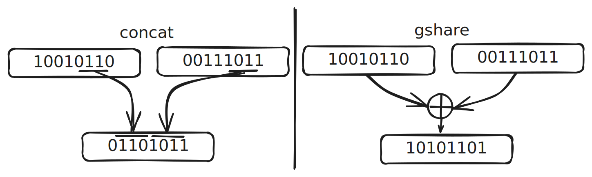
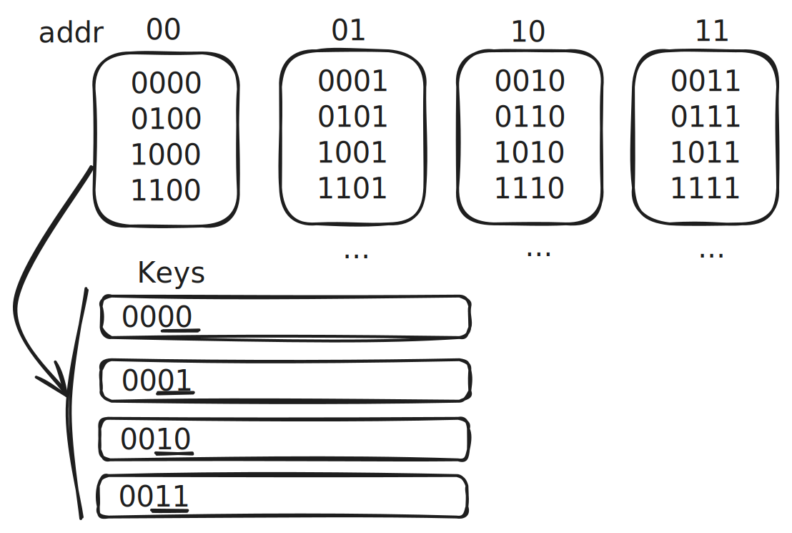

```{r setup, include=FALSE}
knitr::opts_chunk$set(
  warning = FALSE, message = FALSE,
  results = "show", cache = FALSE, autodep = FALSE, error = TRUE
)
```

How do we know if one branch prediction scheme is better than another?
Comparing algorithms comes up all the time in computer science,
and on the assumptions behind better.

For example, is quicksort better than insertion sort?
If you are familiar with computational complexity,
you'll know that quicksort has better average-case performance.
That's a mathematical fact, but there quite a few assumptions
built into that comparison. For starters, quicksort has the same
worst-case performance as insertion sort.
And insertion sort can even have better performance
when the list is "almost sorted".

Another example is iterating over array of structs versus a
struct of arrays. In terms of computational complexity,
they are the same. But struct of arrays might be significantly
faster given the architecture of CPU cache memory.
Again, the comparison depends on the assumptions you make.

So how do we compare branch prediction schemes?
What assumptions do we have to make?
Let's investigate these questions by analyzing the difference
between two hashing methods in two-level adaptive branch prediction
with global history.

I'm not going to cover the details of the algorithm, since
Dan Luu provides a nice overview [here](https://danluu.com/branch-prediction/).
The focus here is on two different methods to calculate the key
for the branch prediction table, rather than comparing two distinct prediction algorithms.
For an n-bit key, the two methods are:

* concatenation: concatenates the last n/2 bits of the address and history
* gshare: takes the XOR of the last n-bits of the address and history

```{r, echo=FALSE}

```

I'll try to answer the following questions:

* why would we think gshare is better than concatenation?
* can we mathematically prove that gshare is better than concatenation?
* can we empirically verify that gshare is better than concatenation?

For the last question, we'll do some fun hacking by
disassembling real programs, using LLDB to trace branch paths
to gather branch history data, and then calculate branch
prediction accuracy for both schemes.

## Reasons to think gshare is better

The basic argument why gshare is superior goes like this:
sometimes using more than n/2 address bits
would give us better predictions and sometimes using more of the branch history
would give us better predictions. The XOR hash in gshare uses more of both
by hashing all n-bits of the address and history into the key!

Compared concatenation where address and history have a predetermined
contribution to the key, gshare seems like an obvious^[Turns out not be obvious.] improvement.
We can even come up with some examples that demonstrate this argument.

### gshare is better

#### Same branch history, different predictions

With gshare, two different addresses with the same branch history
will always map to different keys: this is important
for prediction accuracy when the two branches have
different outcomes.
```
Branch   address history  gshare  concat  actual
A        1010    1011     0001    1011    0
B        1110    1011     0100    1011    1
```

gshare disambiguates the two branches
with different outcomes, while concatenation does not.


#### Using more history bits

Let's assume we have a branch history pattern like this:
```
1101 1101 1101 1101...
```

With a 1-bit prediction table, long-term gshare has a 100%
prediction accuracy, but concatenation does not has 50% accuracy:

```
address history  gshare  concat  actual
1010    1101     0111    1001    1
1010    1110     0100    1000    1
1010    0111     1101    1011    0
1010    1011     1000    1011    1
```

The reason is that the 0111 and 1011 histories alias.
Because the actual result alternates between 0 and 1,
the prediction bit alters as well.
Even if we used 2-bit saturation counter, we would only improve
the accuracy to 75%.

### gshare is worse

However, we can also come up with an example where gshare
does *worse* than concatenation. Two keys in the branch
prediction table will collide in gshare
when the address of one equals the history of the other (and vice versa):

```
Branch   Address  History  Gshare  Concat  Actual
A        0011     1100     0000    1100    1
B        1100     0011     0000    0011    0
```

In this case, both branches map to the same prediction entry (0000)
even though they have different behaviors. Concatenation keeps them
separate because it uses different bits from the address and history.

So if the branch was running in a way where branch A was always executed
before branch B, the prediction accuracy of gshare would be 0%!

(TODO: let's say we have best case scenario with separate branch histories,
even then gshare is zero. Worse)

```
Branch Addr | History | Actual | Key  | Prediction
-----------------------------------------------------------------
0011       | 1001    |      1 | 1010 |         0
-----------------------------------------------------------------
1100       | 0110    |      0 | 1010 |         1
-----------------------------------------------------------------
0011       | 0011    |      0 | 0000 |         1
-----------------------------------------------------------------
1100       | 1100    |      1 | 0000 |         0
-----------------------------------------------------------------
0011       | 0110    |      0 | 0101 |         1
-----------------------------------------------------------------
1100       | 1001    |      1 | 0101 |         0
-----------------------------------------------------------------
0011       | 1100    |      1 | 1111 |         0
-----------------------------------------------------------------
1100       | 0011    |      0 | 1111 |         1
-----------------------------------------------------------------
0011       | 1001    |      1 | 1010 |         0
-----------------------------------------------------------------
1100       | 0110    |      0 | 1010 |         1
-----------------------------------------------------------------
```
To me, this feels like a contrived example and ones
in the previous section feel like the typical case.
But how do we know? Can we prove it?

## Mathematical proof that gshare is worse

Like quicksort vs. insertion sort, maybe we can write
a mathematical proof that gshare is better than concatenation.
Let's come up with some assumptions and investigate.

Let's define a "program" as a set branches, each with a unique n-bit address.
Each address has a random n-bit history.
One dimension of poor branch prediction performance is key collisions.

Can we show that gshare is less likely to have key collisions
than concatenation? **No**. In fact, the opposite is true.
gshare is slightly more likely to have key collisions
than concatenation! [See the appendix](#appendix) for the proof
when the key size is 4-bits.

What's going on here? We know gshare performs better in practice.
The problem is our assumptions. We assumed that the branch history
for each address is random. That might be reasonable assumption
when comparing sorting algorithms (although plenty of real world
data is almost sorted), but this is a really bad assumption for branch prediction.
Branch history is often very predictable, and even a simple algorithm
of "branch taken" can be 70% accurate!^[We are also making the assumption
that key collisions are an indicator
of poor branch prediction performance. That seems true, but who knows?
Maybe there's a clever way to use key collisions to improve branch prediction,
by making sure keys that alias have correlated predictions.]

Instead, we need to gather empirical data on branches taken,
analyze patterns, and compare algorithm performance.

# Hacking executables to gather branch history

Here's my plan:

* disassemble the binary executable to gather the addresses of all branch instructions
* use LLDB to trace the branch paths and gather the branch history
* calculate the branch prediction accuracy for both gshare and concatenation
* compare to the real CPU branch prediction accuracy

I'm sure there are standard benchmarks for branch predictions
algorithms, and I think there are better ways to gather the data as well
(especially if you are on Linux and on Intel processors).
But hacking is way more fun!

The full code is available on [Github](https://github.com/tmastny/gshare/tree/main/extract_branch_data).
Below, I'll share my method and some of the interesting
discoveries I made.

## Disassembling executables

The easiest approach is `otool`:
```bash
otool -tv /usr/local/bin/tree
```
This gives the disassembly of the entire program.

You can also disassemble with LLDB, but it's more complicated.
By default, LLDB only disassembles a single function or frame
rather than the entire program, even if you know the instruction
address range.
`otool` disassembles everything, so I didn't spend any more time
trying to figure out how to do it with LLDB.

Here's a snippet of a branch instruction we'll be parsing
from the assembly:

```asm
0000000100007f03	movq	(%rbx), %rdi
0000000100007f06	testq	%rdi, %rdi
0000000100007f09	je	0x100008281
```

## Parsing instructions

To parse the disassembly, we need to search for and save the address of
all conditional branch instructions.

This will depend on your CPU architecture.
I did this on my 2020 MacBook Air with Intel Ice Lake, which is x86-64.
If you want to run this analysis for yourself on a modern ARM MacBook,
you'll have to both filter for different instructions and
tracing with LLDB will be different as well.

## Tracing with LLDB

Next, we need to run LLDB on the executable, set breakpoints on all branch
addresses, and log the branch history.

I quickly discovered running LLDB on certain executables are off limits: Apple really
doesn't like you attaching a debugger even to something simple like the `ls` command
in `/bin/ls`. I tinkered with SIP and csrutils, but couldn't get anything to work.
If there's a way around this let me know!
I ended up using `tree` and `bzip2` as my test executables, installed with Homebrew.

Typically, you use LLDB on a binary compiled with debugging symbols,
which let you set breakpoints on function names or line numbers.
Even without debugging symbols, compiled binaries have externally available
symbols like function names.
For example, `tree` has `main` and
`emit_tree` symbols.

However, we need to break on addresses.

### Address-based breakpoints

This is a typical branch instruction from the disassembled binary:
```asm
0000000100007f09	je	0x100008281
```
`0x100007f09` is where we want LLDB to break so we can trace the branch history.
Just like we can set a breakpoint on a function name, we can set one
directly on an address.
```
(lldb) target create /usr/local/bin/tree

(lldb) breakpoint set --name main
(lldb) breakpoint set -a 0x100007f09

(lldb) breakpoint list
Current breakpoints:
1: name = 'main', locations = 1
  1.1: where = tree`main, address = tree[0x0000000100004e08], unresolved, hit count = 0

2: address = 0x0000000100007f09, locations = 1
  2.1: address = 0x0000000100007f09, unresolved, hit count = 0
```

At this point, both breakpoints are *unresolved*.
An unresolved breakpoint means LLDB knows where we want to break in theory,
but doesn't yet know where that instruction will actually be located when the program runs.

We call the address written in the binary file (0x100007f09) the *file address*,
and the address where the instruction is loaded into memory the *load address*.
There are a few reasons why file and load addresses might differ:

- Address Space Layout Randomization (ASLR) randomly offsets memory addresses for security
- shared libraries often have overlapping file addresses that need to be relocated when loaded

When we run `target create /usr/local/bin/tree`, the program isn't yet loaded:
rather LLDB gathers all the object and symbol files (called modules or images)
associated with the executable, so we can set breakpoints before the program is running.
Only when we run `process launch --stop-at-entry` or `run` is the program
loaded into memory, the load addresses are set, and the breakpoints are resolved.

For example, here's the symbol table looking at the `emit_tree` in `tree`
and `memcpy` in the dynamic linker `dyld`:
```
# target modules dump symtab tree [/usr/lib/dyld]
Index   UserID DSX Type            File Address/Value Load Address        Name
------- ------ --- --------------- ------------------ ------------------  ---------
[   67]     67   X Code            0x0000000100007ec7                     emit_tree
[   87]     87     Code            0x00007ff80009a140                     memcpy

# after `(lldb) process launch --stop-at-entry`
[   67]     67   X Code            0x0000000100007ec7 0x0000000100007ec7  emit_tree
[   87]     87     Code            0x00007ff80009a140 0x000000010001e140  memcpy
```

For the main executable, the file address and load address are the same.
LLDB by default asks the operating system
to disable ASLR. But even with ASLR disabled, shared libraries may have different
file and load addresses, so LLDB does not resolve breakpoints until the program is loaded.

Now we've set the stage for [bug 38317](https://reviews.llvm.org/D109738).
If we set the file address breakpoint before the program is loaded, and `run`:
```
(lldb) run
...
(lldb) breakpoint list
Current breakpoints:
1: name = 'main', locations = 1, resolved = 1, hit count = 1
  1.1: where = tree`main, address = 0x0000000100004e08, resolved, hit count = 1

2: address = 0x0000000100007f09, locations = 1
  2.1: address = 0x0000000100007f09, unresolved, hit count = 0
```

the breakpiont at 0x100007f09 remains unresolved, even though the program is loaded
and the file and load address are the same! An unresolved breakpoint
will *not* trigger when the program is running.

On the other hand, if we set the breakpoint after the program is loaded
the breakpoint is immediately resolved.
```
(lldb) breakpoint set -a 0x100007f09
Breakpoint 2: where = tree`emit_tree + 66, address = 0x0000000100007f09
(lldb) breakpoint list
...
2: address = tree[0x0000000100007f09], locations = 1, resolved = 1, hit count = 0
  2.1: where = tree`emit_tree + 66, address = 0x0000000100007f09, resolved, hit count = 0
```

Alternatively, we can set the breakpoint with the `-s` flag to tell LLDB
to resolve the address to the file. Then as with the main breakpoint,
the breakpoint will resolve after the process is launched.
```
(lldb) breakpoint set -a 0x100007f09 -s tree
...
1: address = tree[0x0000000100007f09], locations = 1
  1.1: where = tree`emit_tree + 66, address = tree[0x0000000100007f09], unresolved, hit count = 0

(lldb) process launch --stop-at-entry
...
1: address = tree[0x0000000100007f09], locations = 1, resolved = 1, hit count = 0
  1.1: where = tree`emit_tree + 66, address = 0x0000000100007f09, resolved, hit count = 0
```

Nothing we can't work around, but I think it's interesting to see how LLDB
works a bit under-the-hood and how are tools often have some small bugs when
we take a small step off the beaten path.

### Scripting LLDB

LLDB has two nice scripting interfaces: the Python module and LLDB commands.

If you are familiar with the interactive LLDB shell, LLDB commands are the
easiest way to start. All you need to do is to add the commands you would run
interactively to a file and execute:
```bash
# commands.lldb
target create /usr/local/bin/tree
breakpoint set --name main
run
breakpoint set --address 0x100007f09
breakpoint command add -o 'register read rflags' -o 'continue'
continue
# run the script
lldb -s commands.lldb # with -o to run the script and exit
```

Python is also an option.
You'll either need to make sure that you are using the same
Python as LLDB, or you'll need to set the `PYTHONPATH`
to the [LLDB Python module.](https://lldb.llvm.org/use/python-reference.html#using-the-lldb-py-module-in-python)

```python
# commands.py
import lldb

def run_commands(debugger, command=None, result=None, internal_dict=None):
    target = debugger.CreateTarget("/usr/local/bin/tree")
    main_bp = target.BreakpointCreateByName("main")
    process = target.LaunchSimple(None, None, None)
    addr_bp = target.BreakpointCreateByAddress(0x100007f09)

    commands = lldb.SBStringList()
    commands.AppendString("register read rflags")
    commands.AppendString("process continue")
    addr_bp.SetCommandLineCommands(commands)

    process.Continue()
```

```bash
lldb -o "script import commands; commands.run_commands(lldb.debugger)"
```

Lastly, there's the C++ API. The Python API is just a thin wrapper around the C++ API,
so once you are comfortable there it's not hard to move to C++.
You need to install `llvm` to get access to the library and headers.

However, don't expect much of a performance boost. I implemented branch tracing
with all three methods and performance was about the same for a trace with
with about 1000 branches about 20,000 branch predictions:

```
./branch_data_cpp.py  83.095 ± 0.452 seconds
./branch_data_py.py   95.014 ± 0.460 seconds
./branch_data_lldb.py 98.909 ± 0.271 seconds
```


### Instruction stepping

One way to depend a little less on the instruction set
would be to step through the branch instruction and see
where you end up. This was a my first attempt,
but I ran into another bug.

As you saw in the last section, the basic plan is to
set a breakpoint on each branch instruction, and then set a
breakpoint command to log the data.
When looking at the instruction set, we saw that we can
figure out the branch behavior by looking at the flags register,
which we configured LLDB to log:

```
breakpoint command add -o 'read register rflags' -o 'continue'
```

If we didn't want to parse rflags, another approach might be
something like this:
```
breakpoint command add -o 'step instruction' -o 'p\x $pc' -o 'continue'
```

This works great running interactively in LLDB,
I couldn't get it to work in an automated script, with
LLDB commands or in Python.

## Analyzing branch history

Global vs local. Looking at n-bit runs.

## Comparing branch prediction accuracy

gshare worse than concatenation again! tree

gshare better than concatenation! zip

## Profiling CPU branch prediction performance

https://claude.ai/chat/b921fb94-3e04-44f0-b6ec-f7217a721e9d


Try this on intel
```
sudo powermetrics --samplers cpu_power --sample-count 5
```

May have to download xcode :(

# Appendix

## Collisions in a random program

Let's suppose we have a program consisting
of 16 unique branch addresses, each with a random 4-bit branch history.
And let's suppose our branch prediction table has a fixed 4-bit key size,
allowing 16 different keys.

The surprising result is that the XOR
is more likely to have key collisions
than concatenation!

### XOR

Our goal is to show that for 16 unique 4-bit addresses,
with a random 4-bit history, XOR will randomly map the addresses
to any of the 16 keys.

To start, we'll first show that it's possible to map any address
to any key.
Suppose `k` is any possible 4-bit key.
Then if we have a fixed 4-bit address `a`,
we can always find a 4-bit history `h` such that
`k = a ^ h`:

```
k = 0 ^ k = (a ^ a) ^ k = a ^ (a ^ k) = a ^ h
```

And for our address `a`, if two different histories
map to the same key, they are the same history:

```
a ^ h1 =     k =      a ^ h2
    h1 = a ^ k = a ^ (a ^ h2) = h2
```

Therefore, collisions must be possible, since
any address can map to any key and we are randomly
choosing the history.

Now let's reframe the question into a standard combinatorial problem:
imagine our 16 unique
addresses are 16 different balls and our 16 keys are 16 different
bins. What's the expected number of bins with 2 or more balls?

A good approach is to use the complement probability:
 i.e. what's the probability that a bin is empty
and what's the probability that a bin has 1 ball?
Then the probability that a bin has 2 or more balls is

$$
1 - \left( \frac{15}{16} \right)^{16} - \binom{16}{1} \frac{1}{16} \left( \frac{15}{16} \right)^{15} \simeq 0.26
$$

Therefore, 16 * 0.26 = 4.23 bins are expected to have 2 or more balls.
So about 4 collisions are expected.

### Concatenation

Now let's think about concatenation.

This one is a little more complicated and also changes
depending on the concatenation scheme (for example,
we could use a concatenation ratio of 2:1 instead of 1:1).
But to show the general process, let's just analyze the case
where we have 16 unique addresses with a random 4-bit history,
and we concatenate 2 bits from the address and 2 bits from the history
to form the key.

Because we are only using the last 2 bits of the address,
we can treat this problem as 4 separate cases of 4 balls
into 4 bins.

```{r, echo=FALSE}

```

For example, the addresses that end in `00` can only be mapped
to the keys that start with `00`.

Using the same formula as before, the expected number of bins
with 2 or more balls is about 0.267 * 4 = 1.05.
Since there are 4 independent cases of the 4 balls, 4 bins,
the expected number of bins with 2 or more balls is about
4.19.

### Conclusion

So concatenation is less likely to have key collisions
than XOR! So why does gshare work better than concatenation
in practice? Because branch history is not random.
The only way to really know which performs better is to
analyze empirical branching data.
