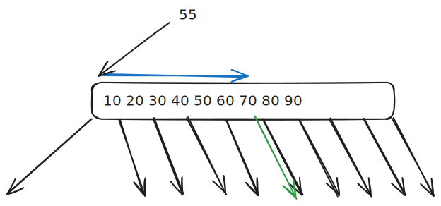

```{r setup, include=FALSE}
knitr::opts_chunk$set(
  warning = FALSE, message = FALSE,
  results = "show", cache = FALSE, autodep = FALSE, error = TRUE,
  echo = FALSE, fig.path = "figure-html/"
)
```

B+ trees are a fun test-bed to study memory performance
because they combine sequential and random access patterns.
If you aren't familiar with B+ trees, check out [this resource](https://cs186berkeley.net/notes/note4/).

Let's explore search: say we want to find the key 55. 
Within a node, keys are already sorted and the algorithm
scans sequentially until the first key greater than 55 is found
(blue arrow).
At that point, we follow the child pointer, which likely requires
a random memory access (green arrow), and it starts scanning again.  



This B+ tree has order 9: that's the maximum number of keys
in a node. Adjusting this parameter changes the height of the tree, 
and the number of keys we have to scan through. A B+ tree of order 1
is like a binary search tree and one with infinite order is an array
(if you like thinking about extremes).

Sequential access and comparison is fast: 
the next key is likely to be in the cache and
there's only a single integer comparison per key.
I'll estimate this to take about 1ns per key.

> There are some exciting mechanisms behind the scenes
> that make sequential access fast. 
> For example, cache line fetching might limit the speed of 
> sequential scanning: after scanning through 64 bytes, the CPU must fetch the 
> next line, which might be in main memory, potentially adding 100ns per 64 bytes processed. 
>
> Fortunately, modern CPUs have a cache prefetcher that can predict
> the next line and fetch it before it is needed, 
> making the 1ns per key estimate a good one.

Following a pointer is expensive. 
The pointer's data is unlikely to be in the cache,
so the data will have to be fetched from main memory. 
I'll estimate the time to load a pointer's data to be 100ns. 

However, the total number of pointers we have to follow is 
always "small". A B+ tree with 1 trillion keys has less than 30 levels, 
regardless of the order.
Worst case, we have to follow 30 pointers, taking 30 * 100ns = 3 microseconds. 

This creates a trade-off: if we have a small order,
the total number of instructions are smaller, but we have to
follow more pointers.
On the other hand, sequential scanning adds up: 
it would take 16 minutes to sequentially scan 1 trillion keys.

## Optimizing B+ tree order

For fun let's estimate the optimal order for a B+ tree with 100,000,000 keys,
and then compare it to a benchmark I ran on my M3 Macbook Air. 

> This analysis focuses on in-memory search performance to isolate and understand cache 
> and random access performance. In the real-world, B+ trees
> do a lot more than search, which is why they are such a useful 
> data structure: they balance efficient search, insertion, and deletion
> and work well with computer and database architecture. 

Let's say we have a B+ tree with 100,000,000 keys. 
If we let $b$ be the order, then we can estiamte 
the time to search for a random key as follows: 

$$
\begin{align*}
\text{Height} &= \log_{b}(100{,}000{,}000) \\ 
\text{Time} &= (\text{Height} \times \text{pointer_time}) + (\text{Height} \times b / 2 \times \text{scan_time})
\end{align*}
$$

To compare against a benchmark, I implemented search and bulk insertion
for a B+ tree in C
[here](https://github.com/tmastny/cache/tree/main/bptree).^[
In the source code, I refer to the order as the minimum number of keys per node, instead of the maximum.
As far as I can tell, they are used interchangeably in various sources.
] The B+ tree was bulk loaded keys 1-100,000,000.
Then I timed 1,000,000 searches for random keys and took the average.

Here are the results.

```{r}
library(readr)
library(ggplot2)
library(dplyr)

btree_results <- read_csv("order,actual
2,1.85
3,0.72
10,0.46
15,0.44
60,0.41
100,0.45
120,0.50
240,0.75
500,1.09
1000,1.97")


actual_vs_expected <- btree_results %>%
  mutate(height = log(100000000) / log(2 * order)) %>%
  mutate(time = (height * 100 + height * order * 1) / 1000)

actual_vs_expected %>%
  ggplot(aes(x = order, y = actual)) +
  geom_point() +
  geom_line(aes(y = time), color = "blue") +
  labs(title = "Impact of B+ tree order on time to search for random key",
       x = "Order", y = "Time (microseconds)")
```

Our basic model does really well at predicting the measured time!
The prediction (blue line) appears off by a constant factor, 
and it grows a little faster than the benchmark for larger orders.
More importantly, it captures the trade-off between sequential 
scanning and pointer chasing, matching the benchmark's
U-shaped curve with both the optimal range around 20-100 
and the performance degradation at the extremes.