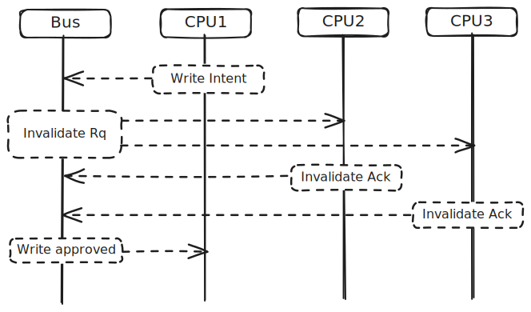

```{r setup, include=FALSE}
knitr::opts_chunk$set(
  warning = FALSE, message = FALSE,
  results = "show", cache = FALSE, autodep = FALSE, error = TRUE,
  echo = FALSE, fig.path = "figure-html/"
)
```

Which program is faster? 

<div class="row">
<div class="col-md-6">
```c
uint16_t a = 0;
uint16_t b = 0;
char c[126];

#pragma omp parallel num_threads(2)
{
    int id = omp_get_thread_num();
    do_work(id == 0 ? &a : &b);
}
```
</div>
<div class="col-md-6">
```c
uint16_t a = 0;
char c[126];
uint16_t b = 0;

#pragma omp parallel num_threads(2)
{
    int id = omp_get_thread_num();
    do_work(id == 0 ? &a : &b);
}
```
</div>
</div>

The second version! Measured over millions of iterations on my M3 MacBook Air,
the second version is 0.68% faster.^[
    `ab.c` [benchmark](https://github.com/tmastny/cache/tree/main/false-sharing#ab-abc)
]

This effect is called false sharing - a performance penalty that occurs when multiple CPU cores 
are forced to synchronize their caches even though they're working with completely independent variables.
Let's explore why `a, b, c` has false sharing, but `a, c, b` doesn't.

## Sharing, True and False

In concurrent programming, the programmer may allow data to be _shared_ between threads.
Say we want any thread to be able to increment `data->value`:

```c
void increment_value(Data *data) {
    pthread_mutex_lock(&data->mutex);
    data->value++;
    pthread_mutex_unlock(&data->mutex);
}
```

To prevent race conditions, threads must synchronize access to shared data.
While one thread holds the lock, other threads trying to acquire the lock must wait
until the lock is released.

False sharing occurs when a variable is _not_ logically shared with any other thread,
but other threads still have to wait on a thread that is modifying the variable. 
In the opening example, `a` and `b` are not logically shared: 
```c
do_work(id == 0 ? &a : &b);
```
Thread 0 is modifying `a` and thread 1 is modifying `b`. Yet they must still wait for each other
to finish modifying the other variable.

## Cache Coherency and Cache Design

The reason has to do with cache coherency and the design of modern caches.
Cache coherence protocols ensure that all CPUs see the same value for a variable.
In the basic model, if a CPU would like to write a variable, it must 
announce its intent to the memory controller. Other CPUs with the same variable
receive that message, invalidate their local copy, and acknowledge the write.
When the writing CPU receives the acknowledgements, it can write to the variable
in its cache.



If CPU2 or CPU3 wants to write or read to that variable, 
the data will be marked as invalid in the local cache and
must be synchronized from CPU1's cache before the operation can complete. 
This synchronization is much faster than a trip to main memory, 
but is still a measurable amount of time. 

The smallest unit of data synchronized between caches is called a cache line, 
which is typically 64 bytes (128 bytes on M-series Apple CPUs). 
If _any_ data in a cache line is modified, the entire cache line must be synchronized:
that's false sharing.

## a, b Example

It's surprisingly easy to create false sharing, 
because compilers typically want to pack data together in memory 
for performance and size. 
This totally normal variable declaration we saw before is vulnerable to false sharing:

```c
uint16_t a = 0;
uint16_t b = 0;
```

`a` and `b` are both 2 byte variables and they are adjacent in memory
since they are declared right next to each other. 
Unless `a` just happened to be in the last two bytes of a cache line,
the two variables will be in the same cache line.
Anytime one is modified, the cache line must be synchronized causing
another thread to wait, like in the following OpenMP snippet:

```c
#pragma omp parallel num_threads(2)
{
    int id = omp_get_thread_num();
    do_work(id == 0 ? &a : &b);
}
```

The [solution](https://github.com/tmastny/cache/blob/1565c00bbee5d3a1891e008e858015d4463f61f8/false-sharing/ab.c#L25-L31)
is to pad the variables so they are in different cache lines.

```c
uint16_t a = 0;
char padding[CACHE_LINE_SIZE - sizeof(uint16_t)];
uint16_t b = 0;
```

It seems a little wasteful, but depending on the workload,
avoiding false sharing significantly improves performance.

## Performance

The impact of the previous example is small: 
padding the variables to avoid false sharing speeds up the program by only 0.68%. 

But we can find more dramatic examples. 
In the last example, two CPUs had to sync on the same cache line,
but my M3 MacBook Air has 8 cores. So let's force the cache coherency
policy to synchronize the same cache line on every core.^[
    `counter.c` [benchmark](https://github.com/tmastny/cache/tree/main/false-sharing#simple-counter-counterc)
]

An array of 8 `uint16_t` is only 16 bytes, 
which easily fits on any modern cache line. 

```c
uint16_t counters[8];
```

If 8 different threads are writing to different elements of the array,
they will have to wait for each other to finish modifying the cache line
before they can do their work.
```c
#pragma omp parallel
{
    int id = omp_get_thread_num();
    do_work(&counters[id]);
}
```

We can avoid this again by padding. There's a couple of different ways to do this.
The first is to create a larger array and index into the array at `CACHE_LINE_SIZE` multiples.

```c
uint16_t counters[8 * CACHE_LINE_SIZE];
// ...
do_work(&counters[id * CACHE_LINE_SIZE]);
```

A more general approach is to use a struct with padding.

```c
struct counter {
    uint16_t value;
    char padding[CACHE_LINE_SIZE - sizeof(uint16_t)];
};
struct counter counters[8];
// ...
do_work(&counters[id].value);
```

Here we see a significant performance improvement: 
the padded version is 25% faster than the unpadded version.

## M-series Processor Performance

One unique feature of the M-series Apple processors 
is the use of Performance (P) and Efficiency (E) cores.
In addition to larger caches and faster clock speeds,
P cores have faster cache interconnects between each other.
Cache interconnections are how cache lines are synchronized between CPUs,
without a trip to main memory.

There are likely cache interconnects between P and E cores, 
but they cores are physically further away and the interconnects 
may have lower bandwidth, so the synchronization takes longer.
We can see this effect when we measure false sharing between P and E cores.

In the counter example above, we have a discontinuous jump in performance after 4 cores:
that's when the cache lines have to synchronize between P and E cores.

Threads | Regular | 128-byte Padded | Improvement
--------|---------|-----------------|-------------
2       | 0.019   | 0.018           | 5.06%
4       | 0.021   | 0.019           | 7.97%
6       | 0.028   | 0.020           | 25.84%
8       | 0.030   | 0.023           | 25.12%

### Atomic Operations

The impact of false sharing across P and E cores is comically large
when working with atomic operations:^[
    `atomic.c` [benchmark](https://github.com/tmastny/cache/tree/main/false-sharing#atomic-operations-atomicc)
]

Threads | Regular | 128-byte Padded | Improvement
--------|---------|-----------------|-------------
2       | 1.362   | 0.189           | 620.1%
4       | 4.201   | 0.193           | 2079.8%
6       | 18.735  | 0.210           | 8821.5%
8       | 20.378  | 0.227           | 8890.4%

Programmatically, the atomic operation is very similar to the normal counter version: 
```c
#include <stdatomic.h>

struct counter { atomic_int value; };
struct counter counters[NUM_THREADS];

#pragma omp parallel
{
    int id = omp_get_thread_num();
    for(int i=0; i<ITERATIONS; i++)
        atomic_fetch_add_explicit(&counters[id].value, 1, memory_order_relaxed);
}
```

But atomic operations have much more stringent requirements for cache coherency.
In particular, they enforce sequential consistency
which means every single atomic instruction from any of the CPU 
must request exclusive access to the cache line, obtain it, write,
and then release. 
This cost increases with the number of cores^[
    See the _Cache line contention_ section of this [blog post](https://fgiesen.wordpress.com/2014/08/18/atomics-and-contention/)
    by Fabian Giesen for more details.
] and apparently increases between P and E cores in this particular architecture.

At first I thought that the normal counter version had to enforce the same level of cache coherency,
but in reality, non-atomic operations are much more lax. 
As Fabian Giesen explains in his [blog post](https://fgiesen.wordpress.com/2014/07/07/cache-coherency/),
caches don't respond to coherency messages immediately, cores execute instructions out of order,
and writes can be batched together in a store buffer before being written to the cache.
This means the normal counter version has false sharing, 
but the synchronization does not happen on every single write. 

## False Sharing Mutexes

Anytime we define variables next to each other,
they might be susceptible to false sharing.
One particular case of this I find amusing is mutexes.

The entire point of a mutex is to synchronize access to a shared resource.
But they are often defined next to each other in memory
at the top of a `.c` file, meaning they are susceptible to false sharing!

```c
pthread_mutex_t mutex1;
pthread_mutex_t mutex2;
```

On my M3 MacBook Air, the size of `pthread_mutex_t` is 64 bytes,
possibly putting them in the same cache line. 

A practical example of this is creating a parallel-friendly 
hash table. You don't want to have a single mutex per hash table,
because then you would have no parallelism. But a mutex per entry
would cost way too much memory.
A good compromise is to assign a fixed number of mutexes, say 16,
and index into them using the hash modulo 16.

```c
pthread_mutex_t mutexes[16];
```

Adjacent mutexes in the array are susceptible to false sharing.
The solution is to pad the mutexes so they are in different cache lines.

```c
struct padded_mutex {
    pthread_mutex_t mutex;
    char padding[CACHE_LINE_SIZE - sizeof(pthread_mutex_t)];
};
struct padded_mutex padded_mutexes[16];
```

I compared the performance of the regular and padded array,
and the padded version only performed better when working across the P and E cores 
(in fact I got a small, but consistent penalty when using padding on just the P cores).^[
    `false-sharing.c` [benchmark](https://github.com/tmastny/cache/tree/main/false-sharing#single-lock-false-sharingc)
] 

Threads | Regular | 128-byte Padded | Improvement
--------|---------|-----------------|-------------
2       | 0.029   | 0.030          | -4.19%
4       | 0.030   | 0.032          | -4.04%
6       | 0.064   | 0.037          | 42.99%
8       | 0.072   | 0.042          | 41.90%

## Conditions for Performance Loss

The performance loss from false sharing is most significant when: 

* **there is a lot of cache line contention**: in the counter examples,
  we have up to 8 threads bouncing the same cache line. With mutexes,
  only two CPUs can false share a single cache line. 
* **the non-memory operations are extremely quick**: in the previous examples,
  all we were doing was incrementing a counter. Here we are locking and
  unlocking a mutex, which has a lot of overhead.

For reference:

Operation                | Approximate Cost
------------------------ | ----------------
Non-atomic Add           | ~1-3 cycles
Atomic Add               | ~5-50 cycles
Syscall Entry            | ~100-1000 cycles
Mutex Lock (uncontended) | ~200-2000 cycles
Context Switch           | ~1000-10000 cycles
Mutex Lock (contended)   | ~2000-20000 cycles

> * Uncontended lock: requires at least one syscall (lock)
> * Contended lock: requires syscall + context switch + another syscall when waking up

The mutexes have such a large overhead, they completely overshadow the false sharing,
or provide enough of a buffer with other instructions to avoid the performance loss.

The following example is a little contrived, but it is possible to consistently
see the impact of false sharing when working with mutexes if you try to acquire
multiple adjacent ones.^[
    `multilock.c` [benchmark](https://github.com/tmastny/cache/tree/main/false-sharing#multi-lock-multilockc)
] 

```c
#pragma omp parallel num_threads(2)
{
    int id = omp_get_thread_num();
    int num_threads = omp_get_num_threads();
    
    // id = 0 takes even locks, id = 1 takes odd locks
    for(int i = 0; i < 10000000; i++) {
        for(int lock_index = id; lock_index < 16; lock_index += num_threads) {
            pthread_mutex_lock(&mutexes[lock_index]);
            do_work();
            pthread_mutex_unlock(&mutexes[lock_index]);
        }
    }
}
```

Threads | Regular | 128-byte Padded | Improvement
--------|---------|-----------------|-------------
2       | 0.367   | 0.367          | 0.22%
4       | 0.222   | 0.219          | 1.41%
6       | 0.335   | 0.197          | 41.18%
8       | 0.309   | 0.160          | 48.22%

## Conclusion

False sharing occurs during concurrent programs when
multiple threads are forced to synchronize logically independent variables
just because they happen to be on the same cache line.
I think this is a fascinating topic that highlights low-level details
of cache design on modern CPUs. 
