```{r setup, include=FALSE}
knitr::opts_chunk$set(
  warning = FALSE, message = FALSE,
  results = "show", cache = FALSE, autodep = FALSE, error = TRUE,
  echo = FALSE, fig.path = "figure-html/"
)
```

# Homemade Quetelet Rings

I made [Quetelet rings](https://en.wikipedia.org/wiki/Quetelet_rings) at home!

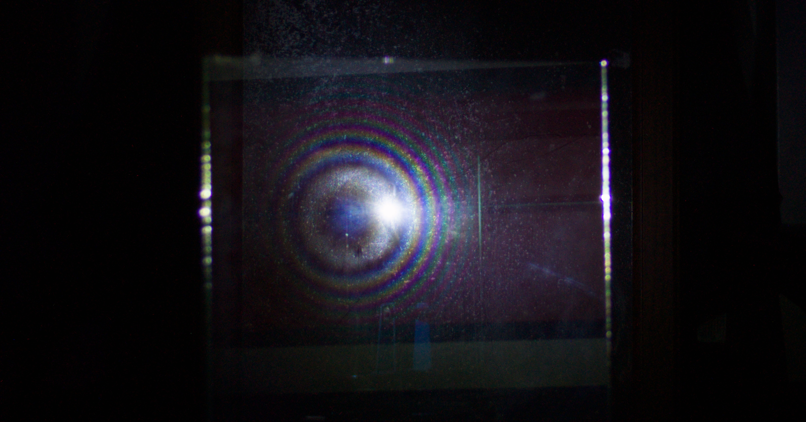

Quetelet rings are color rings that appear when light reflects off a a dusty
mirror. There are many fun questions to explore:

* why are there color bands?
* why does the color pattern change (unlike a rainbow)?
* why are the colored bands circular?
* why are the rings not centered on the light source?

Quetelet rings are usually skipped over in Optics textbooks,
but there is a wonderful explanation in the following paper:

> de Witte, A. J. (1967). Interference in scattered light. *American Journal of Physics*, 35(4), 301–313. https://doi.org/10.1119/1.1974069

I'd like to focus the last question: why are the rings not centered on the light source?
Where are the rings centered?

## Centers of other optical phenomena

A [Corona's](https://en.wikipedia.org/wiki/Corona_(optical_phenomenon)) center is either the sun or the moon,
the source of the light:


A rainbow's center is the [antisolar point](https://en.wikipedia.org/wiki/Antisolar_point):

```{r out.width='50%', fig.align='center', out.height='50%'}
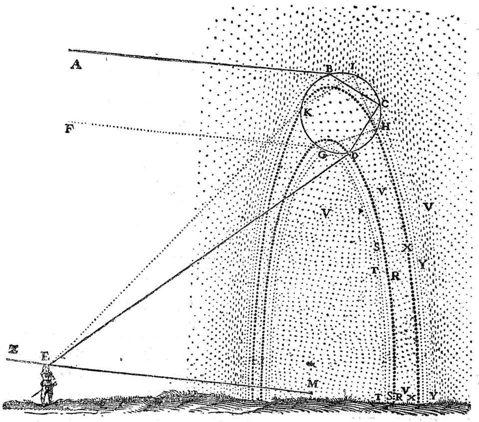
```

For Quetelet rings, the center is similar to the rainbow and changes based on the geometry
of the light and observer.

## Why are there bands of color?

Before we find the center, we do need to understand why there are bands of color,
because we will use that explanation to derive the center location.

The key physical explanation is interference due to optical path length difference
[(See here for a general explanation).](https://openstax.org/books/university-physics-volume-3/pages/3-1-youngs-double-slit-interference)
If two rays from the same source reach your eye with different path lengths,
the resulting wave superposition shifts the wavelength so the resulting color is different.

For Quetelet rings, the two different paths are:

1. light refracts into the glass, reflects, and then scatters off the dust
2. light scatters off the dust, refracts into the glass, and then reflects

de Witt derives the path difference as

\[\Delta = a(\cos\alpha - \cos\beta) \]

from the following diagram:
```{r out.width='70%', fig.align='center', out.height='70%'}
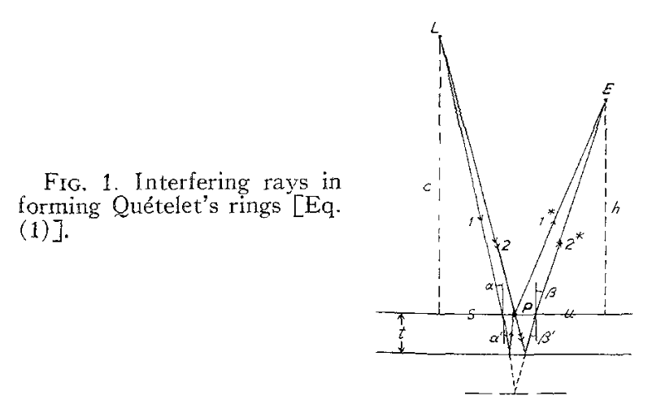
```
Note that I'm simplifying the constants here into a single term $a$ for simplicity.

## Why are the bands circular?

The path difference $\Delta$ only depends on the angles $\alpha$ and $\beta$,
so to find the shape of the bands on the mirror, we need to find the set of points
constrained by those angles.

First, let's use small angle approximation to get
\[\Delta \approx a'(\beta^2 - \alpha^2) \]

Now, we want to find the set of points $(x, y)$ that satisfy this geometry:

```{r out.width='70%', fig.align='center', out.height='70%'}
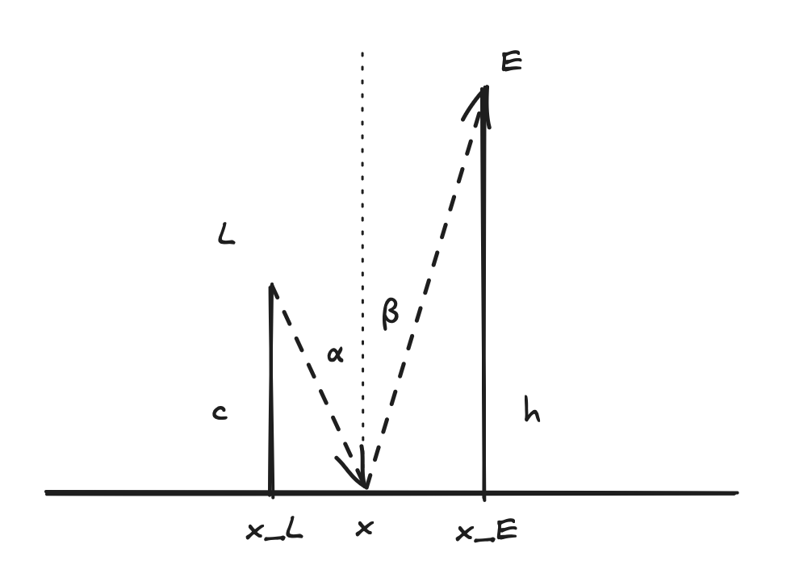
```

With some trigonometry and the small angle approximation $\theta \approx \tan\theta$,
we can derive
\[
\begin{align}
\alpha &\approx \frac{\sqrt{(x - x_L)^2 + (y - y_L)^2}}{c} \\
\beta &\approx \frac{\sqrt{(x - x_E)^2 + (y - y_E)^2}}{h}
\end{align}
\]

So for some new constant $K$, we have
\[K = \frac{(x - x_E)^2 + (y - y_E)^2}{h^2} - \frac{(x - x_L)^2 + (y - y_L)^2}{c^2}\]

Working out the algebra, we get a center point
\[x_C = \frac{c^2x_E - h^2x_L}{c^2 - h^2}\]
(likewise for $y_C$).

## Positions of Light and Eye

Now we can get some good intuition for where the center of the rings will be
based on the geometry of the light and eye.

### c = h

When the light and eye are the same distance from the mirror, $c = h$,
the center point goes to infinity, so the bands appear as straight lines.

### c < h

What about when the camera is twice as far from the light, $h = 2c$? Let's say $x_E = 0$.
Then
\[ x_C = \frac{c^2 \cdot 0 - (2c)^2 x_L}{c^2 - (2c)^2} = \frac{-4c^2 x_L}{c^2 - 4c^2} = \frac{-4c^2 x_L}{-3c^2} = \frac{4x_L}{3} \]

This means the center of the rings is past the light source, from the perspective of the camera!

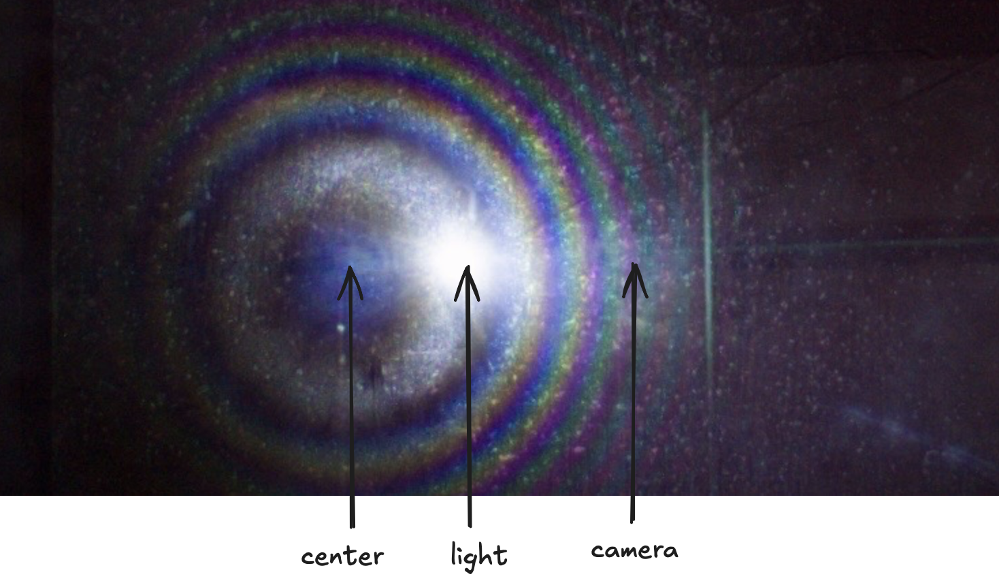

### c >> h

Lastly, when $c >> h$, like when the source of the light is the sun, the equation simplifies to
\[ x_C \approx \frac{c^2 x_E - h^2 x_L}{c^2 - h^2} \approx \frac{c^2 x_E}{c^2} = x_E \]

This is the behavor of naturally occuring Quetelet rings.
These are very rare, but have been documented on algae films in ponds.
Here are some references if you want to learn more:

* https://www.uni-muenster.de/imperia/md/content/fachbereich_physik/didaktik_physik/publikationen/433_colored_rings_on_dusty_surfaces.pdf
* https://atoptics.wordpress.com/2013/09/14/algae-optics-in-wisconsin/
* https://ohio-optics.blogspot.com/2013/08/algae-optics-in-wisconsin.html

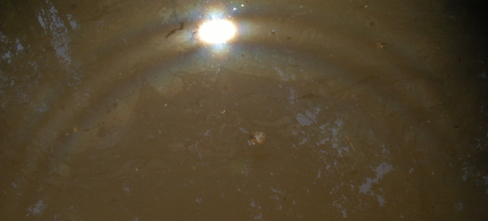

This behavior is similar to rainbows, but with an important difference.
In a rainbow the center is always the antisolar point, but in Quetelet rings
the antisolar point is not the center: it's the point on the other side of the circle,
intersecting the image of the sun and the center.

### c = h and c < h

Here's an image that captures the first two cases, when the light and camera are the
same distance to the mirror and when the camera is twice as far away.
This is not a composite, but rather a single image taken with two different light
sources reflecting off the same mirror.

The camera that took the picture is not the phone, but the larger lens right above it.

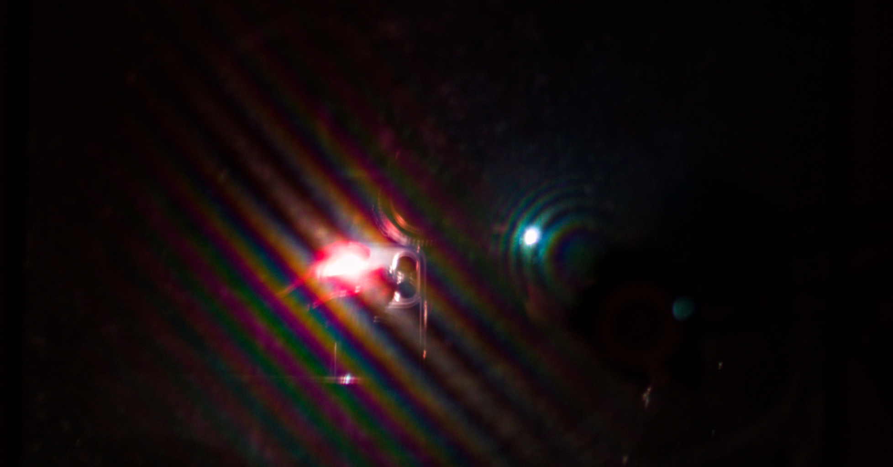

Since you can see the positoin of the lens and the light source in the mirror,
we can easily verify the center geometries.

The $c < h$ case is the white light, with circular colored bands.
As described above you see the lens, light source, and center in that sequence.

The $c = h$ case is the reddish light (from my smartphone flashlight passing through my hand).
The bands appear as straight lines. Again, let's imagine $x_E = 0$ and $c \approx h$.
Then
\[ x_C = \frac{c^2 \cdot 0 - h^2 x_L}{c^2 - h^2} \approx \frac{h^2 x_L}{\epsilon} \]

The center would still be past the light source, but very far away.
To my eye, the bands appear slightly curved towards the lens,
but according to the geometry that must be an artifact of the lens or mirror
rather than a optical property of the Quetelet rings.

## Capturing the full circle

If you try capturing Quetelet rings using the diagram above, you'll only see
part of the rings. That's because the light source itself will be in the path of the camera.

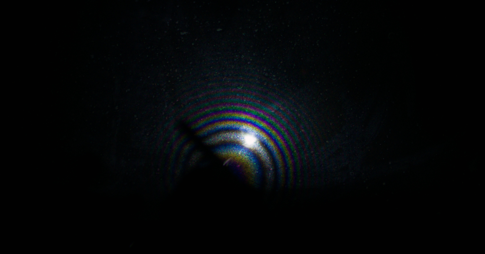

There's different trade-offs you can make to see different shapes,
but some of the reflected light from the
source will not make it to the camera:
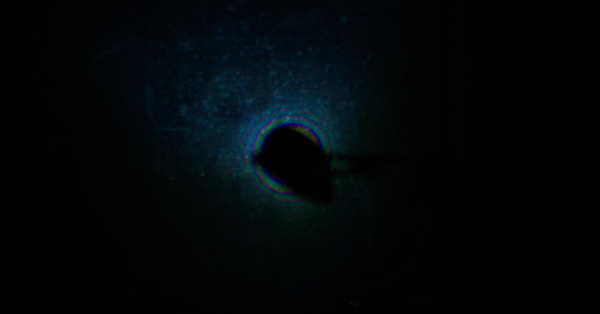

How did I capture the full circle of rings? I used a glass pane from a picture frame
as a [beamsplitter](https://en.wikipedia.org/wiki/Beam_splitter).

## Beamsplitter Setup

Here's the pullback shot:


The flashlight is shooting through the pane of glass positioned at a 45 degree angle.
Most of the light passes through onto the red piano, but ~5% reflects off the glass into the mirror.

The mirror reflects the light _back_ throught glass pane: this time most of the light
travels through the glass pane into the camera.

Setup diagram:

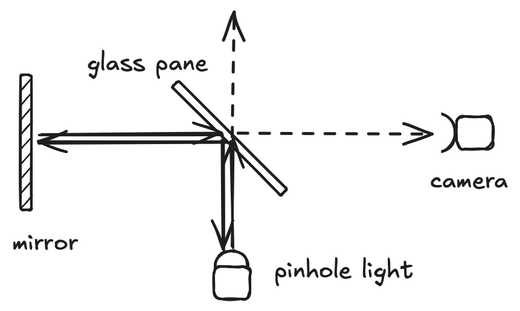

And two images of the setup in light:

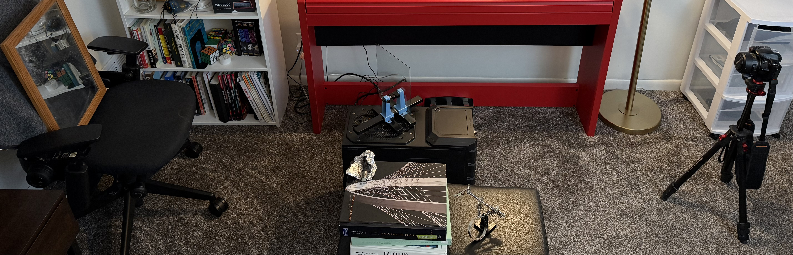

And more from the caemera's perspective:

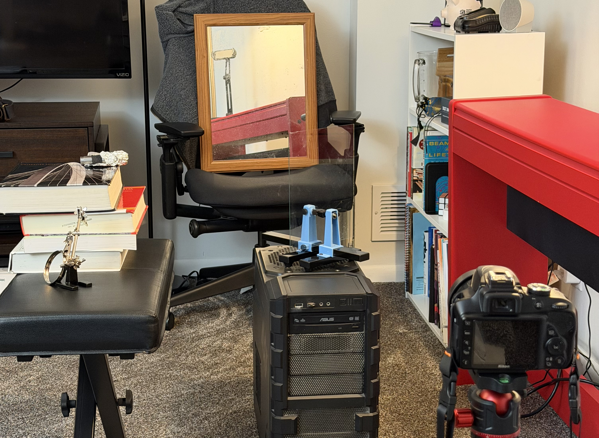

Lastly, de Witt also diagrams out the beamsplitter setup in his paper:

```{r out.width='70%', fig.align='center', out.height='70%'}
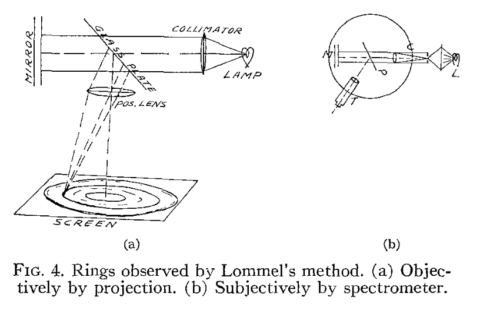
```
