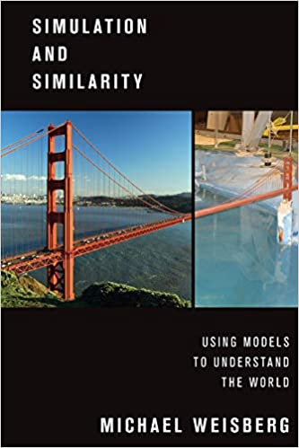

[Simulation and Similiarity](https://www.amazon.com/Simulation-Similarity-Understand-Studies-Philosophy/dp/0190265124)

Notes from Alex Hayes's ([website](https://www.alexpghayes.com/),
[Twitter](https://twitter.com/alexpghayes)) philosophy of stats book club.
All my notes are written with [notion.so](https://www.notion.so/) so please
leave a comment!

Follow along at [#philstatbookclub](https://twitter.com/search?q=%23philstatbookclub&src=typed_query).

## Week 1

* Chapters 1 and 2 [notes](https://www.notion.so/Simulation-and-Similarity-2525272efbf14bfca6b480b69e907116)
