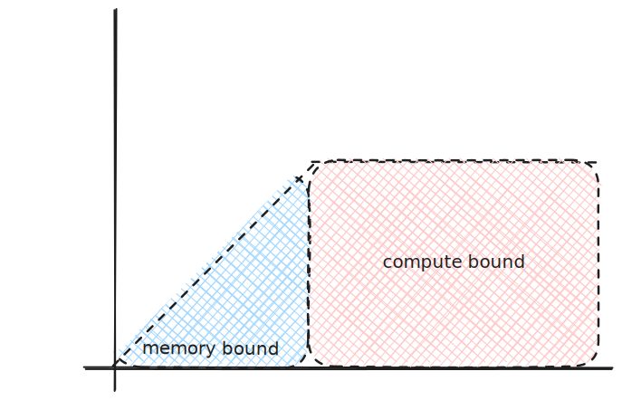
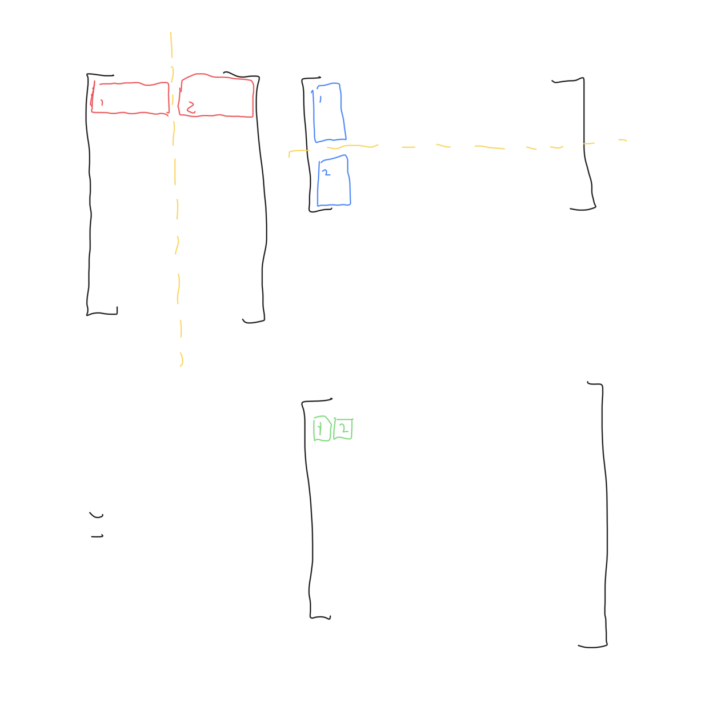

# jax 1

## rooflines

We need to do 1e12 FLOPs,
and the GPU can manage 9.89e14 FLOPs/s
* 1e12 / 9.89e14 = 9.89e-2 s ~  1 ms


Next, say the problem needs to process 1e9 bytes,
and the GPU can process 1e10 bytes/s
* 1e9 / 1e10 = 0.1 s

Now for the program, we can calculate
the FLOPs/byte (arthmetic intensity):
* 1e12 FLOPs / 1e9 bytes = 1e3 FLOP/byte

Finally, we can compare this to our computation
and memory speeds:
* 1e3 FLOP/byte * 1e10 bytes/s = 1e13 FLOPs/s
    * this is less than the GPU's 9.89e14 FLOPs/s
      so the program is memory-bound
* 1 byte / 1e3 FLOPs * 9.89e14 FLOPs/s = 9.89e11 bytes/s
    * this is more than the GPU's 1e10 bytes/s,
      so the program is memory-bound

Lastly, we can compare the arthemtic intensity directly:
* 9.89e14 FLOPs / s / 1e10 bytes / s = 9.89e4 FLOPs/byte
* 1e3 FLOPs / byte < 9.89e4 FLOPs/byte,
  so the program is memory-bound.



### example

dot product:
```
x * y: bf16[N], bf16[N] -> bf16[1]
```
Need to load 2 * 2 bytes per element,
for a total of 4 * N bytes.

And we need 2 * N FLOPs
* pairwise multiple and then sum

So arthemtic intensity is
* 4 * N / 2 * N = 2 FLOPS / byte

Given peak FLOPS/s of TPU v5e MXU is 240 FLOPs / byte,
our program is memory-bound.
* I think that also makes sense from cache principles:
  we do 2x the load operations compared to FLOPs.
    * add, multiple (and fused multiply-add) are ~1 cycle
    * memory load even from L1 cache is 4-5 cycles


Intuition: 
* low, constant arithmetic intensity likely
  means that the program is memory-bound

Another idea:
* the TPU has MXU (matrix unit) and (VPU) vector unit
* the VPU has arithmetic intensity of about 3 FLOPS/byte,
  so the program isn't as memory-bound as it first appears

### matrix multiplication

```
X * Y -> Z: bf16[B, D], bf16[D, F] -> bf16[B, F]
```

Load
* 2BD + 2DF bytes
Write
* 2BF bytes

Each element of Z is dot product of row of X and column of Y
* 2D FLOPS per element
* 2DBF total FLOPS

Arthemtic intensity:
* 2DBF / (2BD + 2DF + 2BF) = DBF / (BD + DF + BF)
* if batch size B is small relative to D and F:
    * DBF / DF = B

So if B > 240, then the program is compute-bound.
* example: batch size tokens B < 1204, D, F > 8000
* So if B > 240, then the program is compute-bound.

### shard matrix multiplication

```
X * Y -> Z: bf16[B, D], bf16[D, F] -> bf16[B, F]
```

We split along the D dimension: the columns of X
and the rows of Y:


The output of each is a partial sum of the output matrix,
so we still need to copy the partial sum to GPU 2 and add them
together. 

Let's find T_{math}:
* program FLOPs is 2BDF: 2D per element, BF elements
    * alternatively: D/2BF + D/2BF = DBF
* TPU FLOPS/s is 1.97e14
* T_{math} = 2BDF / 1.97e14
* half since we are sharing = BDF / 1.97e14

For T_{comms}: 
* move output to the other GPU: 2BF bytes
* Given we can copy 4.5e10 bytes / s
* T_{comms} = 2BF / 4.5e10

Arthemtic intensity of network for TPU
* 1.97e14 FLOPS /s / 4.5e10 bytes / s = 4380 FLOPS/byte

Compute bound if T_{comms} < T_{math}:
* 2BF / 4.5e10 <  BDF / 1.97e14
* 1.97e14 / 4.5e10 = 8760 < D

Now we see sharding if compute bound given D instead of B. 

### matrix dimensions

Let's take a step back: what is B the batch size?

Each row is an sample. If we were doing image
classification, each row would be an image. 

D then is the features of the sample. For a raw image,
D would be all the pixels.

LLMs are a bit different. Take this for example:
* we tokenize sentence
* map each word to an integer
* then map each integer to a D vector
```
"Hello world!" → 
["Hello", "world", "!"] → 
[457, 1234, 89] → 
Three vectors of dimension D
```

So for LLMs, we might actually be looking at something like this,
for a batch size of 1, and S is the sequence length.
```
X * Y -> Z: bf16[B, S, D], bf16[D, F] -> bf16[B, S, F]
X' * Y' -> Z': bf16[S, D], bf16[D, F] -> bf16[S, F]
```

Now we can see that when sharing efficiently, 
we actually want a larger embedding dimension
to become compute bound.

This is intriguing: larger D means we can fully utilize
our hardware _and_ it theoretically gives better model performance.
That's a cool convergence!

Why is it compute bound on D? Well the time for math depends on BDF
and the network only depends on BF. So as D increases, so does the
computation time, but the network time is fixed. 

## q1

```
A[B, D] * B[D, F] -> C[B, F]
```
with int8 precision, 1 byte per parameter.

### (1)

How many bytes need to be loaded from memory? 
How many need to be written back to memory?

Loaded:
* DB + DF
Written:
* BF

### (2)

How many total OPs are performed?

Technically 0 right? These aren't floating points? 
Or I guess it's an 8-bit floating point? Never heard of that tbh.

Each output matrix element is 2D operations.
There are BF output elements, so 2BDF.

### (3)

What is the arithmetic intensity?
* 2BDF / (DB + DF + BF)

using "B small" approximation:
* 2BDF / DF = 2B

### (4)

* peak OPs / s: 3.94e14
* peak bytes / s:  8.1e11
* 3.94e14 / 8.1e11 = 486

Then compute bound if 2B > 486:
* B > 243

Ah, misunderstood this a bit. How can we estimate T_{math}?
* T_{math} = 2BDF / 3.94e14
* T_{comms} = (DB + DF + BF) / 8.1e11

So if we want to estimate the total time:
* lower bound is max(T_{math}, T_{comms})
* upper bound is T_{math} + T_{comms}

## q2

```
bfloat16[B, D] * int8[D, F] -> bfloat16[B, F]
```

int8 is for efficient memory and training, 
but we do a bfloat16 op.

* Input: 2DB + DF
* Output: 2BF
* total: 2DB + DF + 2BF

Ops:
* 2BDF 

Ops:
* 1.97e14 bfloat16 ops / s
* 8.1e11 bytes / s
* 1.97e14 / 8.1e11 = 243

Arthemtic intensity:
* 2BDF / (2DB + DF + 2BF)

using "B small" approximation:
* 2BDF / DF = 2B
* can we get rid of the 2?
    * BDF / 1/2DF = 2B
    * I guess it's the same either way

So compute bound if 2B > 243:
* B > 121.5

Okay, so let's think this example through. 
When we use int8 weights, we are compute bound when B > 120 instead of B > 240. 

So what does this mean if we have a program where B = 200. 
If we had bfloat16 weights, our program would be comm bound, 
where T_{comms} > T_{math}.

With int8 weights, we are now compute bound, since B = 200 > 120. 
The T_{math} did not change, since we have up convert int8 to bfloat16 to compute,
but our T_{comms} when down. 
That means the overall execution time when down too. 

## q3

But doesn't the roofline model only depend on B?

## q4

```
int8[B, D]_D * int8[B, D, F]_D -> int8[B, F]
```

Load and store: BD + BDF + BF

For OPs:
If we think about the first row of int8[B,D] it's a 1xD vector 
and are we multiplying it by a [D,F] matrix, the first "column" of [B, D, F]. 
That would give an output of a 1xF vector. 

Now we do that for B-1 more rows, each with a unique [D,F] matrix, 
and that gives us a [B,F] output. 

The difference being instead of taking the input 1xD row from [B,D] and doing a dot product of Dx1 column to get a scalar, we use a matrix to transform it into a 1xF vector. 

Instead of taking each input and mapping to a single number, 
we use a vector to map it to a different vector. Likewise, another
way to think is that we can encode more information in the transformation:
instead of D weights, there are DF weights. 

