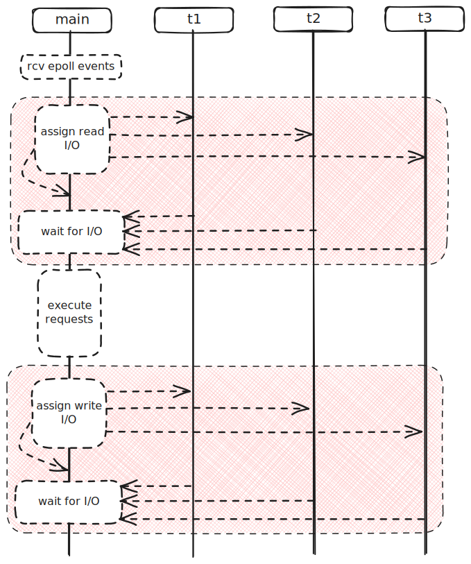

# Problem 4

https://sirupsen.com/napkin/problem-4

## Attempt

Redis: single-threaded in memory key-value store.
If the key was an integer, should be as fast as looking
up a value from main memory, or 50 ns according to ref.
Especially because each "value" is <64 bytes, a single
cache line.

According to the ref, the throughput of 64 bytes of random
memory is 1 GB/s. 

But our system is getting:
* 10^4 requests/s * 64 bytes/request = 640 KB/s
* way too slow!

Upper bound on requests/s:
* 10^9 bytes/s / 64 bytes/request = 15 million requests/s

Networking:
* ref: throughput of 4 GB/s, faster than random memory
* latency: 10 us per 32 KB. 

What if we were only sending 64 bytes per TCP data packet?
* 64 bytes / 10 us = 6.4 MB/s
* 6.4 * 10^6 bytes/s / 64 bytes/request = 10^5 requests/s

That's 10x off from the 640 KB/s we're getting.

## Solution

TCP echo benchmark is our speed-of-light
comparison for networking: this is the theoretical 
best case. 

That's why it's a useful comparison for the application code,
in this case `GET` and `SET` in the key-value store.
In our case, networking should be the bottleneck, because
the application code is so fast.

But what's we are really seeing is that we are 10x off 
from the theoretical maximum: we should be able to serve
more requests. 

## How Redis 6 Threaded I/O Works

Here's a thorough explanation of Redis 6's Threaded I/O,
with diagrams and a look at the source code: 
https://www.sobyte.net/post/2022-03/redis-multi-threaded-network-model/

In the Threaded I/O model, everything is orchestrated
by the main thread. The main thread waits for I/O events from epoll.
Once events are received, the main thread assigns each socket to an I/O thread
to read and parse the request.

The main thread waits for the all the I/O threads to finish,
and then executes the request on the data structure.
Each reply is stored in a client reply buffer. 

After all the requests are processed, the main thread
assigns I/O threads to each client to send the reply to the
client socket. 

One interesting feature is that the main thread is also an 
I/O thread: it will always assign itself one client socket to
read and process, and one client to write to.

The synrchonization is lightweight: the main thread
assigns work to the I/O threads, processes it's own client,
and then continuously polls the I/O threads until they are finished. 
There's also no mutex locks: access to the shared data is staggered over time,
so no thread is contending for the same data.

There's a few other detail, but it's all covered in the sobyte.com
article. So instead, I'll share a diagram of that explains the big picture. 

