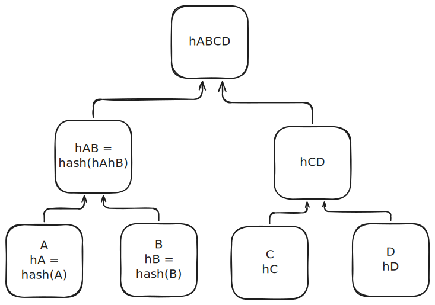

# Problem 8

https://sirupsen.com/napkin/problem-8

## Attempt

### (a)

* updated_at is uint64, so 8 bytes
* hashing: 
    * ref: 25 ns / 64 bytes, 1 s / 2 GB
    * 25 * 10^-9 s / 64 bytes * 8 * 10^5 bytes = 3.125 10^-4 = 31.25 * 10^-5 = 312.5 us
    * 1s / 2 * 10^9 bytes * 8 * 10^5 bytes = 4 * 10^-4 = 400 us

`updated_at` is in a db, so we also might need to think about loading pages,
iterating over them, etc.

Assuming they are on similar computers, I don't see why the 
server or client would be faster than the other.
* servers can be small and low-cost, or large.
* clients can be old PCs or M4 MBPs. 
So it seems hard to assume one is faster than the other from
a pure hardware standpoint.


Say 200 bytes per row. Pages are 16 KB. 
* 16 * 10^3 bytes / page * 1 row / 2 * 10^2 bytes = 80 rows / page
* 1 page / 8 * 10 rows * 10^5 rows = 1250 pages
* 1250 pages * 100 us / page = 125 ms
  * ref: 100 us/8KB random SSD access, 1 us to read the next 8KB chunk.

Most of the time is spent loading the pages, not hashing them. 
* assumes all pages are own disk. 
* the server has to work with many users, so maybe it's reason 
  user_id = 1 is not in the buffer pool.

This would require more disk and page reads if the table was
not index on `user_id`.

#### Client 

Okay, maybe the client and server have similar computers,
but if the client is `user_id = 1` then:
* 1250 pages in db, 16 KB / page = 20 MB

That could easily be in the the client's memory.

Worst case, we need a random access per page:
* 50 ns to fetch cache * 1250 pages = 62.5 us

Total: 62.5 + 400 us (to hash) = 450 us

### (b)

An index on `user_id` is important, but I basically 
assumed in (a) that it already was. 

At first I thought maybe we could use `updated_at` to filter
the rows we need to hash, but user 1 could have updated _any_
of the rows. 

### (c)

The total dataset is only 20mb, which is reasonable to send 
to both client and server.

But how do we merge the rows? 
Suppose we went offline at 0:
```sql
-- initial
id | user_id | desc1 | desc2 | updated_at
1  | 1       | hello | world | 100

-- client
id | user_id | desc1 | desc2 | updated_at
1  | 1       | hello | WORLD | 100

-- server
id | user_id | desc1 | desc2 | updated_at
1  | 1       | HELLO | world | 200
```

If all we had were the final states, the best we could do would be
to take the latest value. Without an additional data structure
tracking the changes, we don't know what the original values were.

For all the server knows, the old value of `desc2` was `WORLD` and
the update at 200 changed `WORLD -> world`. 

Given that there were only two updates, a client at 100 and the server at 200,
we know the merged dataset should be:
```sql
id | user_id | desc1 | desc2 | updated_at
1  | 1       | HELLO | WORLD | 200
```

Therefore, we know that we need to store each update, what was changed,
and when it happened. Then apply that sequence during the merge.

Something like this:
```sql
{
    "id": 1,
    "desc2": "WORLD",
    "updated_at": 100
},
{
    "id": 1,
    "desc1": "HELLO",
    "updated_at": 200
}
```

We can sort these by `updated_at` and apply them in order.

#### merges

In the last example there's a pretty clear "right" way to merge
the rows. But there is no universal algorithm for merging:
it depends on the programmer to decide what's right for the 
application. 

For example, let's say the client runs two updates,
and the server runs one:
```sql
-- client
id | user_id | desc1 | desc2 | updated_at
1  | 1       | hello | WORLD | 100
1  | 1       | hello | World | 200

-- server
id | user_id | desc1 | desc2 | updated_at
1  | 1       | hello | worlD | 300
```

The application needs to make a decision on
how to merge the changes. But changed the original
value `world`. _And_ the client changed it first!
But the server made the latest change. However,
the client made the last "version" change.

In text fields like `desc2`, you might often want to
combine them into a final result like `WorlD`.
For merging text fields specifically, check out:
https://timmastny.com/rga/

Detecting the conflict is the first step, 
the application also needs to decide how to resolve it.


#### state

Funny enough, the revision table from [problem 7](../p7)
provides a nice way to store all the updates if we wanted
to use a state-based CRDT.


## Solution

https://sirupsen.com/napkin/problem-9

### (a)
Estimates:
* 256 bytes per row, 25 MB of data
    * I said 200 and 20 MB!

* Assume everything is on disk
    * my assumption as well

Hash:
* 1 MB / 500 us
    * mine: 2 GB / s 
* the main difference is he calculated the hash of the full 25 MB,
  but I only calculated the hash of the `updated_at` field,
  8 bytes * 10^5 rows = 8 * 10^5 bytes = 0.8 MB, or about 400 us

Reading from db:
* 25 MB * (500 us / 1 MB + 1 ms / MB) ~ 40 ms

This is way faster than mine, what did I miss?
* I assumed every page was one disk and would
  require 100 us to access: a totally random 8 KB 
  read from disk. 
* Another point I missed: we can't be sure this is 
  indexed on `user_id`. If it's not, we'll need to do 
  a full table scan. 
* Moreover, a piece of intuition I lacked was that 
  knowing we must do a full table scan, the database
  and SSD can likely load random pages in parallel,
  giving a 2x speedup (I think this is his pre-fetching idea)
* Another related idea I found interesting
    * when the query planner knows that it must do a full table scan,
      it won't use any index, because doing "sequential" random 
      reads while iterating through leaf nodes on a B+ tree is slower
      than doing all random reads at once.
    * the idea is that the B+ tree pointer to the next page
      is not known ahead of time: but the for a full table scan,
      we don't need to go in any order, and can request all pages
      from the SSD at once.

    * And that's what he meant by "pre-fetching":
        * the query planner requests batches of pages
          from the disk, processes then, and gets
          ready to request the next batch when the processing
          is almost done.
        * prefetch depth tries to balance the work of the CPU
          to how fast the disk can deliver data.

Syncs per second:
* didn't even really think to estimate this time, 
  but it makes sense, since we know we have multiple users
* about 1 sync / 10 ms = 100 syncs / s
* 1000 users * 1 sync / 3600 s = 0.3 syncs / s
    * so our estimated speed should handle 1000 users syncing
      once per hour. 
    * We could serve 100x that without trouble. 
* I really like this approach: calculate our expected performance,
  and then see how many customers we can serve.
    * It's like calculating latency and then comparing it to human
      perception of acceptable latency.


Client:
* I assumed the client might be faster, because they would
  only need to store their data.
* But I completely forgot they could be a mobile client! 
  That would be much slower. 

### (b)

Idea: hash `(user_id, updated_at)`
* because we are only filtering on `user_id` and
  querying `updated_at`, the index pages could be much more
  dense can we could process fewer pages per disk!
  Because each B+ tree record would be 8-16 bytes rather than ~200.
    * the general term is *covering index* or *index-only scan*:
      when the query can be answered only by the index! So cool. 

### (c)

Merkle Trees: what do I know about them before reading the solution?
* they somehow hash chunks of data, so you can send data
  in pieces and verify that you've gotten right data (like in a torrent).

I think they work something like this:


The idea is that each of you can compute and compare `hABCD`. 
If they differ, then you compare `hAB` and `hCD`. Say
`hAB` match: then you know those rows are the same.
If `hCD` differs, then at last you compare `hC` and `hD`
to find out which row is different.


