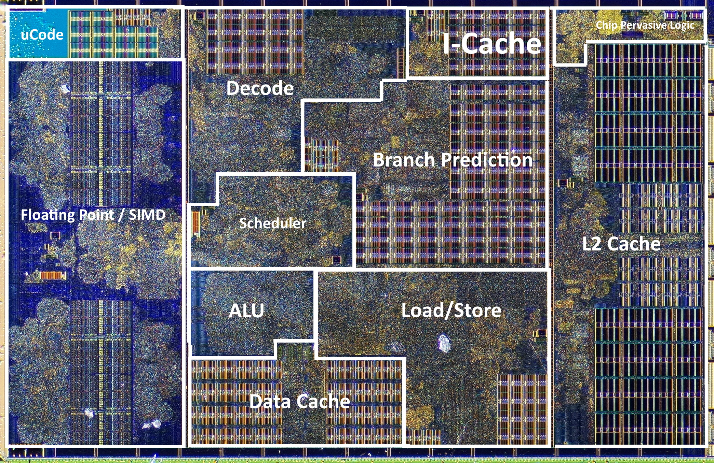
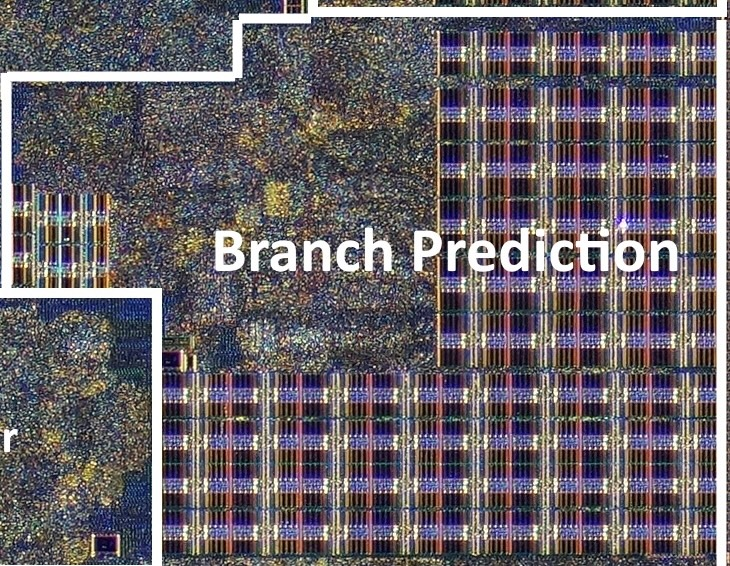

```{r, echo=FALSE}

```

Die shot of a Zen CPU core by AMD (~1,400,000,000 transistors)

source: https://en.algorithmica.org/hpc/complexity/hardware/


???
AMD architecture created in 2017 and still used by AMD CPUs.

Branch prediction unit takes up 15-20% of the die!
So it must be critical for performance.
The size rivals L1 cache, which is critical for performance.

Why does it take up so much space?
To answer, we first need to understand at a basic level
how the CPU works.

---

CPU mental model: one step at a time

<div id="nonpipeline-container"></div>

<script>
document.addEventListener('DOMContentLoaded', function() {
  const container = document.getElementById('nonpipeline-container');
  container.innerHTML = createPipelineHTML('nonpipelineViz');

  window.nonpipelineViz = new PipelineVisualization(
    document.getElementById('nonpipelineViz'),
    {
      instructions: [
        "add $t1",
        "sub $t2",
      ],
      sequence: [
        { pc: 0 },
        { pc: 1, if: "add $t1" },
        { pc: 1, id: "add $t1" },
        { pc: 1, ex: "add $t1" },
        { pc: 1, mem: "add $t1" },
        { pc: 1, wb: "add $t1" },
        { pc: 2, if: "sub $t2" },
        { pc: 2, id: "sub $t2" },
        { pc: 2, ex: "sub $t2" },
        { pc: 2, mem: "sub $t2" },
        { pc: 2, wb: "sub $t2" },
        { pc: null }
      ]
    }
  );
});
</script>

???
So at the top are instructions the CPU needs to process
and each box at the bottom is a stage that is an isolated
hardware unit that can function independently.
Don't worry about the details,
but you should know that an instruction needs to go through
each stage.

But this process is really inefficient, because
those hardware units are just sitting there idle.

What is want is an assembly line!

---

CPU mental model: assembly line

<div id="pipeline1-container"></div>

<script>
document.addEventListener('DOMContentLoaded', function() {
  const container = document.getElementById('pipeline1-container');
  container.innerHTML = createPipelineHTML('pipelineViz1');

  window.pipelineViz1 = new PipelineVisualization(
    document.getElementById('pipelineViz1'),
    {
      instructions: [
        "add $t1",
        "sub $t2",
        "lw $t3",
        "add $t5",
        "and $t4"
      ],
      sequence: [
        { pc: 0 },
        { pc: 1, if: "add $t1" },
        { pc: 2, if: "sub $t2", id: "add $t1" },
        { pc: 3, if: "lw $t3", id: "sub $t2", ex: "add $t1" },
        { pc: 4, if: "add $t5", id: "lw $t3", ex: "sub $t2", mem: "add $t1" },
        { pc: null, if: "and $t4", id: "add $t5", ex: "lw $t3", mem: "sub $t2", wb: "add $t1" },
        { pc: null, id: "and $t4", ex: "add $t5", mem: "lw $t3", wb: "sub $t2" },
        { pc: null, ex: "and $t4", mem: "add $t5", wb: "lw $t3" },
        { pc: null, mem: "and $t4", wb: "add $t5" },
        { pc: null, wb: "and $t4" },
        { pc: null }
      ]
    }
  );
});
</script>


???

Now each stage operates at the same time,
immediately starting work on the next
instruction,
which makes the CPU much, much faster.

So much faster, CPU manufactures are willing
to use 20% of the die space to make this happen.

---

But what do you do about branches?

<div id="branchpipeline-container"></div>

<script>
document.addEventListener('DOMContentLoaded', function() {
  const container = document.getElementById('branchpipeline-container');
  container.innerHTML = createPipelineHTML('branchpipeline');

  window.branchpipeline = new PipelineVisualization(
    document.getElementById('branchpipeline'),
    {
      instructions: [
        "beq r1, r2, br",
        "add r7, r1, r4",
        "lw r8, 0(t6)",
        "add r8, r8, r9",
        "sw r8, 0(t6)",
        "sw r7, 4(t6)",
        "add r3, r1, r4",
        "br: and r9, r10, r11",
//        "sub r5, r3, r6"
      ],
      sequence: [
        { pc: 0 },
        { pc: 1, if: "beq r1, r2, br" },
        { pc: 2, if: "add r7, r1, r4", id: "beq r1, r2, br" },
        { pc: 3, if: "lw r8, 0(r7)", id: "add r7, r1, r4", ex: "beq r1, r2, br" },
        { pc: 4, if: "add r8, r8, r9", id: "lw r8, 0(r7)", ex: "add r7, r1, r4", mem: "beq r1, r2, br" },
        { pc: 7, if: "and r9, r10, r11", wb: "beq r1, r2, br" },
        { pc: null, if: "sub r5, r3, r6", id: "and r9, r10, r11" },
        { pc: null, id: "sub r5, r3, r6", ex: "and r9, r10, r11" },
        { pc: null, ex: "sub r5, r3, r6", mem: "and r9, r10, r11" },
        { pc: null, mem: "sub r5, r3, r6", wb: "and r9, r10, r11" },
        { pc: null, wb: "sub r5, r3, r6" },
        { pc: null }
      ]
    }
  );
});
</script>

???

The EX stage is part of the CPU that calculates the operands
of the instruction:
in this case, comparing if the r1 and r2 registers are equal.

So when the branch instruction finishes this stage,
the CPU knows it should have taken the branch
and moved on the the br label.

The CPU doesn't just have to pause the assembly line:
it has to throw away all the work it's already done!


Throwing away work and starting over slows down the CPU:
so how do you mitigation this?

---

Add hardware!


.left-column[
.small-image[


* memory


* logic

]
]
???

The branch prediction unit makes up 20% of the die space!
That is really substantial!

* it's similiar in size to the L1 cache,
which, among many improvements,
makes iterating over arrays 100x faster.

* We are giving up floating point operations i.e. FLOPS,
one of the primary measures of performance.

All to predict branches.

So what is the hardware in the branch prediction unit?

* Memory: SRAM, same type as the L1 cache
(with a less complicated implementation).
The memory stores the branch history, which is
critical for prediction.

* Logic: this is the complicated feedback
mechanism to predict and recover from branches.

--


.right-column[

]


<style>
.left-column {
  width: 30%;
  float: left;
}

.right-column {
  width: 65% !important;
  float: right;
}

.right-column img {
  width: 100%;
  height: auto;
  margin-top: 20px; /* Optional: adjust vertical alignment */
}

.small-image img {
  width: 200px;
  height: auto;
}
</style>
???
While the memory is more straightforward compared to the L1 cache,
the logic is very complicated. Here's a glimpse of the logic
for a basic MIPs CPU, which is vastly more simple
than modern CPUs which use superscalar pipelines.
--

# What could go wrong?

???
With all this complexity, what could go wrong?
---
background-image: url(spectre.svg)

--

# Spectre Security Vulnerability

???
This was a massive security vulnerability
shared in 2018 that impacted all modern CPUs.

The core problem was branch prediction.

Before we dive into how Spectre works,
let's first look at what was done to mitigate it.

---

How was the Spectre mitigated?

.right-column2[

]

<style>
.right-column2 {
  width: 35%;
  float: right;
}

.right-column2 img {
  width: 100%;
  height: auto;
}
</style>
--

* software
--

  * patches saw 5-30% performance degradation
--

  * CPU were only improving 5-10% YoY
--

  * lost 3-6 years of progress

--


* hardware
--

  * it wasn't*

???

The fundamental exploit still exists.
I'm able to exactly reproduce the the exploit on my
2020 Intel MacBook Air. I'll share a link if anyone is interested.

Let's walk through an example and see how it works,
even on modern CPUs.

---

<div id="spectre-viz"></div>

<script>
document.addEventListener('DOMContentLoaded', function() {
    window.initSpectreViz('spectre-viz');
});
</script>

---

# Should we still be worried?

Yes and no.

--

**No**

* Spectre targets sensitive data *within* the same user process

???
This vastly limits the scope of the attacks.
--

* key attack surface areas have already seen mitigations
--

  * browsers
  * shared libraries
  * user kernel mapping
--


* exploit is more difficult to execute
--

  * less accurate timing available to user processes
  * compiler mitigations

--

**Yes**

--

* the fundamental exploit still exists
???
Maybe people will find more sensitive data in user space
that could be exploited.

---
# Where to learn more?

* Branch prediction series on my blog
  * https://timmastny.com/blog/visualizing-cpu-pipelining


* this slideshow with interactive animations
  * https://timmastny.com/slides/branch-prediction


* Github code for Spectre V1 demo x86 processors
  * https://github.com/tmastny/gshare/tree/main/spectre
